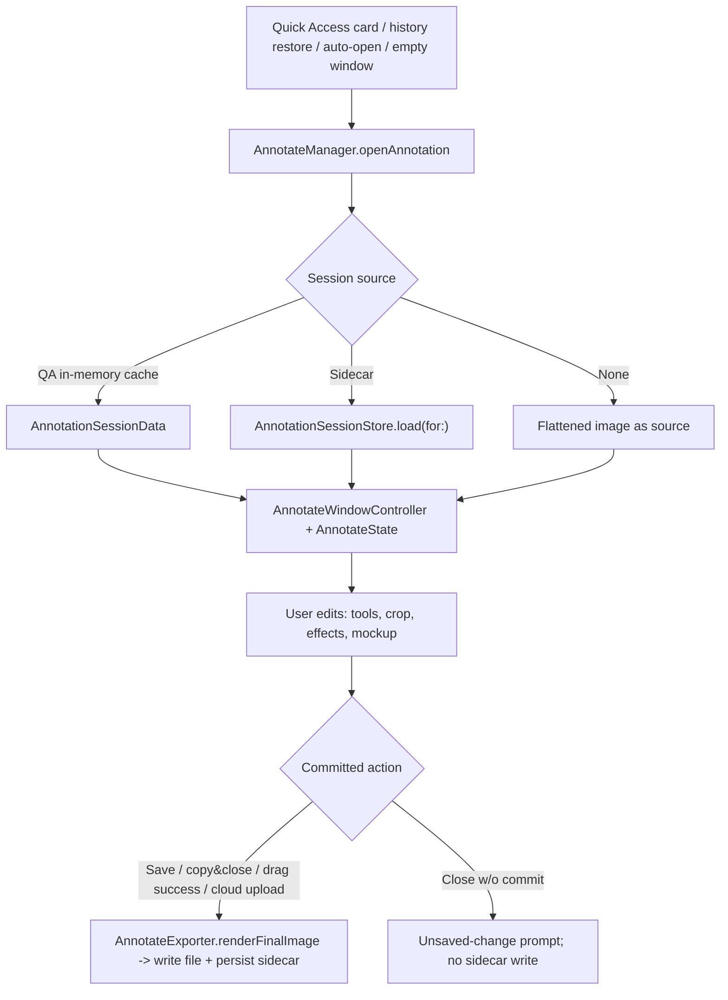
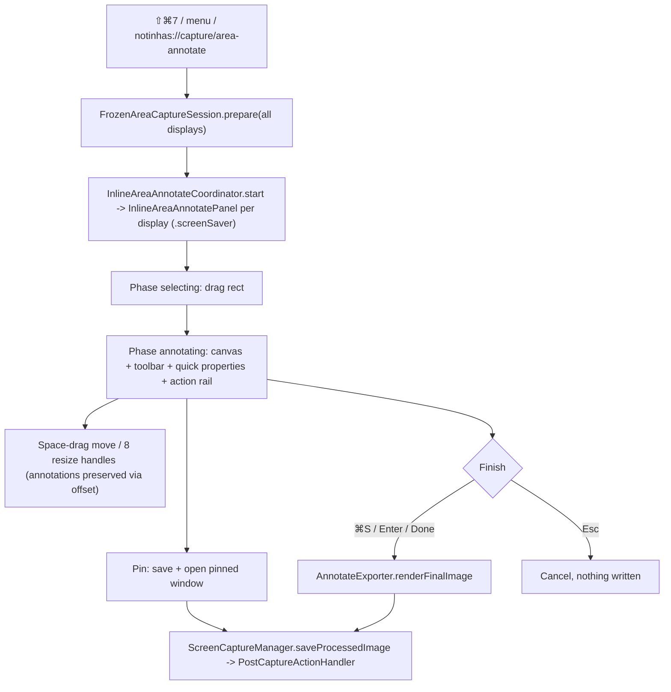

# Annotate Editor & Capture Markup

Notinhas's annotation subsystem: the full Annotate editor window (hybrid AppKit shell + SwiftUI chrome + AppKit drawing canvas) and the inline area-annotate overlay (Capture Markup) that reuses the same engine before save. Both render final output through one exporter path.

## Architecture

- `Notinhas/Features/Annotate/AnnotateManager.swift` — singleton window registry; session cache keyed by `QuickAccessItem.id`; activation policy bump to `.regular` on open; `openAnnotation(for:)` (QA item) / `openAnnotation(url:sessionData:)` / `openEmptyAnnotation()`.
- `Notinhas/Features/Annotate/Managers/AnnotateWindowController.swift` — per-window controller, owns save/copy/close notifications.
- `Notinhas/Features/Annotate/Managers/AnnotateWindow.swift` — `NSWindow` subclass; intercepts ⌘+scroll zoom, trackpad magnify, Space key (pan mode via `annotateSpaceDown/Up` notifications), drag events; level floats while key (`activeEditorLevel`) and restores `restingLevel` on resign; pin sets resting level `.floating`.
- `Notinhas/Features/Annotate/AnnotateState.swift` — central `ObservableObject` (~4.8k lines): annotations, tools, undo/redo, zoom/pan, canvas effects, crop, cutout, mockup, combine, cloud state.
- Layout (`AnnotateMainView`): `AnnotateToolbarView` → `AnnotateQuickPropertiesBar` → `HStack(AnnotateSidebarView 240pt | AnnotateCanvasView)` → `AnnotateBottomBarView`.
- Rendering: `DrawingCanvasNSView` (AppKit event container) + 5 stacked `CanvasLayerView`s composited by CoreAnimation — spotlight overlay → static-below → dragged → static-above → gesture preview. Static layers redraw only when invalidated (CA reuses their backing store), so per-frame cost is flat in annotation count and colors always render through the standard pipeline (no offscreen bitmap color management). Deterministic export via `AnnotateExporter.renderFinalImage` (mockup: `renderMockupFlatImage` off-main + `compositeMockupImage` on main — `ImageRenderer` is main-only).
- Gesture handling: drag/resize/draw gestures mutate gesture-local `AnnotationItem` copies (no `@Published` churn) and commit once on `mouseUp` via the regular `AnnotateState` update methods + one undo checkpoint; the manipulated item draws in the dragged layer between the static layers (exact z-order). Invalidation: content publishers (`$annotations`, selection, `$sourceImage`, …) redraw all layers; other state only the cheap live layers. Full redraw path culls items outside the dirty rect.
- Render z-order (`renderOrdered` in `AnnotateAnnotationItem.swift`, shared by canvas + exporter + hit-testing): embedded images bottom → blur/redact → markup (shapes, arrows, text, counters, …) top. Stable within tiers; model array order unchanged, so blur never covers shapes in canvas or export.
- `AnnotateState.EditorMode`: `.annotate` (flat editing), `.mockup` (3D transforms), `.preview` (hides editing UI).

### Save-and-close ordering (perf)

⌘S/close-with-save is ordered so the Quick Access card reappears with an unblocked main thread:

1. `markAsSaved` + session cache + `state.makeRenderSnapshot()` — freezes every render input into a value-type `AnnotateRenderSnapshot` (warms lazy embedded-CGImage caches, pre-resolves main-bound wallpaper/blur images).
2. Instant anti-flash thumbnail: `cacheDisplay` of the canvas region (`DrawingCanvasNSView`, no toolbar/sidebar chrome) downscaled to 200px — set on the card immediately; the pin window is NOT updated with it.
3. `forceClose()` — window hidden + closed, card reappear commits.
4. `Task.detached`: off-main `renderFinalImage(snapshot:)` → off-main 200px downscale → main push of the authoritative thumbnail + pin full-res update + `markCloudStale` (guarded by a per-item save generation, last-save-wins) → `saveToFileOffMain` (encode off-main; scoped write + history on main) → sidecar persist off-main (`AnnotationSessionStore.persistOffMain`) → clipboard re-copy off-main (`ClipboardHelper.copyImageOffMain`, serialized).

The `.accessory` activation-policy revert is deferred to a later runloop turn (shared by Annotate/VideoEditor) so it never stalls the reappear. Signposts (`perf.signposts` default + Instruments `com.notinhas.perf`): `AnnotateReturn`, `instantThumbCapture`, `windowClose`, `render`, `thumbnailScale`. Perf evidence: `plans/260718-1956-quick-access-annotate-return-perf/reports/`.

## Tools & Shortcuts

`AnnotationToolType` (`Models/AnnotateAnnotationToolType.swift`) — 15 tools, single-key defaults, all rebindable via `AnnotateShortcutManager`:

| Tool | Key | Tool | Key | Tool | Key |
| --- | --- | --- | --- | --- | --- |
| selection | `v` | arrow | `a` | blur | `b` |
| crop | `c` | line | `l` | spotlight | `s` |
| rectangle | `r` | text | `t` | counter | `n` |
| filledRectangle | `f` | highlighter | `h` | watermark | `w` |
| oval | `o` | pencil | `p` | mockup | `m` |

- `drawableTools` shared with inline overlay so surfaces stay in sync; `supportsQuickPropertiesBar` false for selection/crop/mockup.
- Quick properties bar (`AnnotateQuickPropertiesBar`): context controls — primary color, text background, blur type, arrow style/bend/heads, watermark text/style/opacity/rotation, stroke width, font size, corner radius. Modes `hidden / toolDefaults / selectedItem`.
- "Sync tool defaults" pref (`annotate.quickPropertiesSyncEnabled`, default on): tool defaults (color, stroke width, font size, corner radius, watermark opacity/rotation) shared across compatible tools via `SharedAnnotationParameterDefaults` (`annotate.parameterDefaults.v1`) when nothing selected; per-tool defaults stay independent when off (`annotate.toolParameterDefaults.v1`). Selected-item numeric edits stay local; slider drags grouped into one undo checkpoint.
- Favorite colors capped at 4 per role (`AnnotateColorPaletteStore.maximumFavoriteColorCount`; custom colors cap 24).

## Arrows

- `ArrowGeometry` (`Models/AnnotateAnnotationItem.swift`): `ArrowStyle` = straight / curvedRight / curvedLeft; `ArrowType` = classic / tapered / outlined.
- Double-sided heads: `ArrowEndpointStyle` `startHead` / `endHead` (commit `b299bad`); applies to `.classic` — tapered/outlined bake the head into the body.
- Figma-style endpoint dragging for arrows + lines (commit `22766cb`).

## Blur / Pixelate

- `BlurType` — 8 effects: pixelated, gaussian, hexagonal, crystallized, pointillism, halftone, tape, washi.
- `AnnotateBlurEffectRenderer` — CoreImage/Metal rendering with quality tiers.
- `AnnotateBlurCacheManager` — non-blocking preview cache: miss draws lightweight placeholder, background work coalesced per annotation. Budgets: 1.6 MP per blur (`maxCachedPixelsPerBlur = 1_600_000`), 8 MP total (`maxTotalCachedPixels = 8_000_000`). Save/copy/share/export bypass the cache and render deterministically through `AnnotateExporter`.

## Spotlight

- `AnnotateSpotlightCompositor` — dim-with-holes compositing via transparency layers + clear blend mode; overlapping regions union.
- Single global dim opacity clamped 0.1–0.9 (default 0.5), sourced from first committed region.

## Counter, Highlighter, Watermark, Crop

- Counter: click-to-place, auto-increment per placement; diameter derived from stroke width.
- Highlighter: freehand with auto-straighten for near-straight strokes.
- Watermark: `WatermarkStyle` single / diagonal / tiled; editable text, opacity, size, rotation, color.
- Crop: shrink AND expand canvas (drag handles outside source creates annotatable empty canvas, included in export). `CropAspectRatio` presets Free/1:1/4:3/3:2/16:9/21:9 + portrait toggle. Esc cancels, Return/⌘S commits; while cropping, `CropToolbarView` replaces the bottom-bar right side.

## Undo/Redo

- `UndoEntry` = `.annotations(AnnotationSnapshot)` | `.rotation(RotationSnapshot)` — rotation undo never disturbs the annotation path.
- Text-edit commits as one transaction; quick-properties slider gestures scoped to a single checkpoint (`quickPropertiesGestureUndoSnapshot`).

## Zoom & Pan

- Range 0.25–16x: `minimumZoomLevel 0.25`, default max 4.0, `hardMaximumZoomLevel 16.0`; `effectiveMaximumZoomLevel` grows to `1/fitScale` for very long captures.
- Input: pinch magnification, ⌘+scroll, Space+drag pan, ⌘=/⌘−/⌘0 (fit); zoom picker presets + `1:1` actual-pixels in bottom bar.

## Backgrounds & Mockups

- `BackgroundStyle` (`Models/AnnotateBackgroundStyle.swift`): none / gradient (8 `GradientPreset`s) / wallpaper(URL) / blurred(URL) / solidColor. `BlurredBackgroundEffect`: soft / frosted / vivid / dim.
- `SystemWallpaperManager` (`Services/Wallpaper/`) — 12 bundled JPG wallpapers + custom wallpaper security-scoped bookmarks; thumbnail cache.
- Aspect ratio (`AspectRatioOption`: Auto/Free/1:1/4:3/3:2/16:9) + orientation toggle + 9-way `ImageAlignment`.
- Mockup mode: integrated 3D tilt — rotation X/Y/Z, perspective, shadow — via `AnnotateMockupTransformModifier` + `AnnotateMockup3DRenderer`; 8 `MockupPreset`s in `DefaultPresets.all` (flat, leftTilt, rightTilt, topView, isometricLeft, isometricRight, heroShot, dramatic); inline preset bar `MockupPresetBarInline`.
- Standalone `MockupManager` window (`Managers/AnnotateMockupManager.swift`) has no remaining callers — orphaned; mockup UX lives in editor mode.

## Remove Background (Cutout)

- Toolbar button, macOS 14+; `ForegroundCutoutService` (`Services/Media/`) runs Vision `VNGenerateForegroundInstanceMaskRequest`.
- Non-destructive overlay: original kept, cutout composited through `effectiveSourceImage`; revert restores original.
- Crop-aware auto-crop: `ForegroundAutoCropPolicy` heuristics → `ForegroundAutoCropDecision` enum; auto-crop applied only when `.suggested` and pref on; applied rect tracked (`cutoutAutoAppliedCropRect`) for exact revert on toggle-off.
- Global pref `backgroundCutout.autoCropEnabled` (default true), shared with capture-time cutout flow.

## Auto Sensitive-Data Redaction

- `AnnotateSensitiveRedactionService` — 100% on-device: Vision OCR → `AnnotateSensitiveDataDetector` deterministic matching. Detects emails/phone numbers/URLs (NSDataDetector), credit cards (Luhn + issuer prefixes + contextual multi-line parsing for number/expiry/cardholder rows), credential key=value pairs, Bearer/AWS/GitHub/Slack/Stripe/OpenAI/JWT tokens.
- Creates editable pixelated blur annotations in one undo checkpoint; recognized text never persisted; pixels bake only at export.
- Triggered from the blur tool's quick-properties bar; action shortcut `.autoRedactSensitiveData` ships unbound (`AnnotateShortcutManager`).

## Combine Images

- `CombineImagesCoordinator` (`Features/Annotate/CombineImagesCoordinator.swift`) — picker entry from status bar menu or `notinhas://open/combine?file=...`; requires ≥2 images.
- Modes: autoStitch / freeCanvas; direction smart / horizontal / vertical; edge snapping; session persisted as `PersistedCombineSession` inside the sidecar manifest.

## Session Sidecars

- `AnnotationSessionStore` root: `~/Library/Application Support/Notinhas/AnnotationSessions/<SHA256(normalizedPath)>/`.
- Package: `manifest.json` (`PersistedAnnotationSession`, schemaVersion 1, `PersistedFileSignature` = size + modifiedAt + extension) + `original.bin` + optional `cutout.png` + `assets/` (embedded images). Signature mismatch (replaced file at same path) → sidecar ignored, never restores annotations onto wrong pixels.
- Commit-based writes only: save, save-and-close, copy&close, successful drag-to-app, cloud upload/re-upload, inline annotate finish, default-preset auto-apply. NO draft autosave; unsaved windows keep the normal unsaved-change prompt.
- Restore order: QuickAccess in-memory session cache → sidecar → flattened file.
- Cleanup paths: QA delete, Annotate delete-image, history delete, clear-history, retention sweep (incl. orphan sidecars), move-on-save (temp→export moves sidecar to new path hash).

## Drag-to-App

- `AnnotateDragHandleView` + `DragHandleNSView`: lazy `NSFilePromiseProvider` (`AnnotateDragFilePromiseProvider`) + guaranteed rendered file-URL fallback staged under `Captures/AnnotateDrag/` so file-url-only targets accept the first drag.
- `DragFallbackSignature` invalidates/renders the staged fallback when editor state changes.
- Completion policy: `annotate.closeAfterDrag` (default true — saves edits, dismisses QA card) and `annotate.bringForwardAfterDrag` (default false — reactivate preserved editor).

## Bottom Bar

- Left: zoom picker + mode segmented toggle (annotate/mockup/preview).
- Center: drag handle (compacts when tight).
- Right: new window, share (`NSSharingServicePicker`), cloud upload, pin (⌃⌘P), copy&close (⌘⇧C), delete (confirm; clears history record + sidecar + QA card, trashes file).
- Cloud button gated by `CloudManager.shared.isConfigured && QuickAccessActionConfigurationStore.shared.isEnabled(.uploadToCloud)`; ⌘U posts `annotateCloudUpload`; overwrite confirmation when item has a `cloudKey` and is stale. Note: commit `dd4ccd5` removed only the after-capture auto-upload preference — manual uploads here stay.
- Edits after upload mark item cloud-stale (`isCloudStale`) until re-upload clears it.

## Rotation & Canvas Presets

- Rotate 90° left/right from toolbar; dedicated `RotationSnapshot` undo entries.
- `AnnotateCanvasPresetStore` (`annotate.canvasPresets.v1`): background style, blur effect, spacing, shadow, corner radius, aspect ratio + orientation. One preset can be default (`annotate.defaultCanvasPresetId.v1`).
- Default preset auto-applies to new screenshots during post-capture via `ScreenshotPresetAutoApplier` — lightweight `AnnotateExporter.renderCanvasEffects` without constructing full `AnnotateState`, returns editable session data. Inline area annotate does NOT auto-apply.

## Inline Area Annotate (Capture Markup, ⇧⌘7)

Select region and annotate before saving, inside per-display overlays sharing one desktop coordinate space. Same engine/tools as the full editor minus crop and mockup.

### Inline shortcuts

| Key | Action | Key | Action |
| --- | --- | --- | --- |
| `Enter` / `⌘S` | Finish & save | `B` | Blur |
| `⌘C` | Copy rendered image | `S` | Spotlight |
| `Esc` | Cancel | `N` | Counter |
| `Space` (hold) | Move selection | `W` | Watermark |
| `V`/`R`/`F`/`O` | Selection / Rect / Filled / Oval | `P` | Pencil |
| `A`/`L`/`T`/`H` | Arrow / Line / Text / Highlighter | | |

- `InlineAreaAnnotateSession` owns the selecting→annotating state machine; panels at `.screenSaver` level with `canJoinAllSpaces` work across Spaces.
- Move/resize refreshes the cropped source via `replaceSourceImagePreservingAnnotations(_:annotationOffset:)`; cross-display crops use `FrozenAreaCaptureSession.cropCompositeImage`.
- Action rail: Pin-to-Screen / Cancel / Done (prominent) / Copy. Pin runs the normal post-capture pipeline once, then opens the saved image in a pin window.
- No crop, no mockup, no canvas-preset auto-apply.

## Related docs

- [CAPTURE.md](CAPTURE.md) — capture flows feeding the editors
- [SCROLLING_CAPTURE.md](SCROLLING_CAPTURE.md) — long captures (dynamic zoom max)
- [QUICK_ACCESS.md](QUICK_ACCESS.md) — card edit action, pin windows, session cache
- [HISTORY.md](HISTORY.md) — restore flow and sidecar lifecycle
- [POST_CAPTURE.md](POST_CAPTURE.md) — routing incl. preset auto-apply
- [CLOUD.md](CLOUD.md) — manual upload + stale/re-upload semantics
- [PREFERENCES.md](PREFERENCES.md) — Annotate settings keys
- [SHORTCUTS.md](SHORTCUTS.md) — global shortcut registry
- [LOCALIZATION.md](LOCALIZATION.md) — L10n ownership
