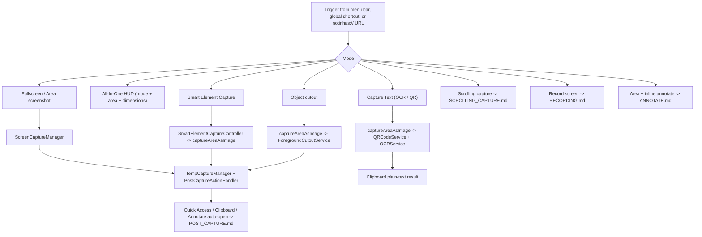
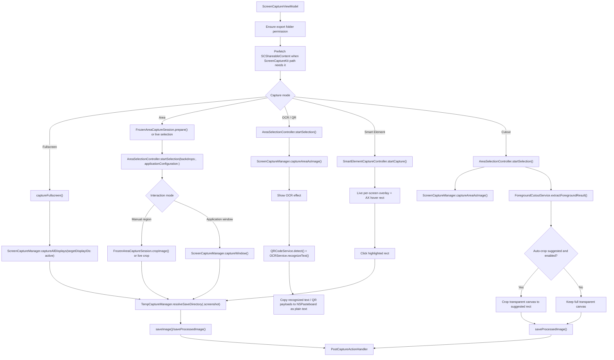

# Screenshot Capture Flows

This doc covers the screenshot capture pipeline: capture modes, the area-selection overlay, OCR/QR, object cutout, and Smart Element — from trigger to saved file. Scrolling capture, screen recording, post-capture routing, and the editors have their own docs (see Related docs).

User-facing copy in these flows is localized through `Notinhas/Shared/Localization/L10n.swift` and `Notinhas/Resources/Localization/{Shared,Features}/*.xcstrings`. Privacy permission copy lives in `InfoPlist.strings`. For localization ownership and rules, read [`LOCALIZATION.md`](LOCALIZATION.md).

## Flow Index

## Capture Modes

| Mode | Default trigger | Coordinating types | Output |
| --- | --- | --- | --- |
| All-In-One | Menu / optional `⇧⌘0` / `notinhas://capture/all-in-one` | `AllInOneCaptureCoordinator` + Plan 035 HUD + Plan 036 refinement | Each mode button dispatches its capture action |
| Fullscreen | `⇧⌘3` | `ScreenCaptureViewModel.captureFullscreen()` → `ScreenCaptureManager.captureAllDisplays(targetDisplayIDs:)` | Image file per active display |
| Area (manual region) | `⇧⌘4` | `startAreaCapture(.manualRegion)` → `AreaSelectionController` + `FrozenAreaCaptureSession` or live path | Cropped image file |
| Application window | Menu / shortcut / `notinhas://capture/application` | Same overlay, `.applicationWindow` mode → `ScreenCaptureManager.captureWindow(target:)` | Window image incl. shadow (macOS 14+) |
| Active window | Menu / shortcut / `notinhas://capture/active-window` | `ActiveWindowResolver` (AX focused window) → `captureWindow` | Window image |
| Area + inline annotate | `⇧⌘7` | `InlineAreaAnnotateCoordinator` (see [`ANNOTATE.md`](ANNOTATE.md)) | Annotated image file |
| Scrolling | `⇧⌘6` | `ScrollingCaptureCoordinator` (see [`SCROLLING_CAPTURE.md`](SCROLLING_CAPTURE.md)) | Stitched long image |
| OCR text | `⇧⌘2` | `OCRService` + `QRCodeService` | Clipboard text only (no file) |
| Object cutout | `⇧⌘1` (macOS 14+) | `ForegroundCutoutService` | Transparent PNG |
| Smart element | `⌥⇧4` | `SmartElementCaptureController` + AX services | Cropped image file |

All shortcut defaults are configurable; see [`SHORTCUTS.md`](SHORTCUTS.md). `ScreenCaptureViewModel` (`Notinhas/Features/Capture/CaptureViewModel.swift`) is the single entry point for every mode and implements `KeyboardShortcutDelegate`.

## Screenshot, OCR, and Cutout

### Fullscreen and area notes

- Fullscreen resolves the active display from `ScreenUtility.activeDisplayID()` when triggered, then runs through `ScreenCaptureManager.captureAllDisplays(targetDisplayIDs:)` so `Cmd+Shift+3` captures only the screen the user is interacting with. The hot path uses `CGDisplayCreateImage` for the target display when cursor and desktop icon/widget exclusions are off; it falls back to ScreenCaptureKit for correctness when those options are enabled.
- The fullscreen capture engine can still run without `targetDisplayIDs` for explicit all-display captures. Multi-display post-capture remains batch-aware: Quick Access and history receive every file, clipboard receives file URLs for multi-file batches, and auto-open Annotate opens only the first saved screenshot.
- Screenshot outputs use a minimum 2x pixel-density baseline. Low-density external display captures are promoted before saving so fullscreen, area, scrolling, cutout, and inline-annotated screenshots stay consistent with Retina-display output. When a selection spans Retina and non-Retina displays, the composite crop promotes and edge-enhances each low-density display slice before drawing it into the shared 2x canvas, preserving native Retina slices without re-sharpening them.
- Area screenshot has two selection modes controlled by Preferences → Capture → "Freeze area capture". Default since v1.26.0 is **live (non-frozen)**: the on-screen content keeps animating during selection and the chosen region is captured at mouse-up through `ScreenCaptureManager.captureArea(rect:)` → `makePreparedAreaCaptureContext` → `capturePreparedArea`. When the live selection spans **multiple displays**, `captureArea` detects the cross-display condition via `displayIDsIntersecting`, captures all intersecting displays in parallel using `captureDisplaySnapshotsCore`, then composites them through `FrozenAreaCaptureSession.cropCompositeImage` — reusing the frozen path's multi-display composite algorithm (DRY). Single-display selections keep the optimized single-capture path. **Frozen** is opt-in and freezes the active display first via `FrozenAreaCaptureSession`, then either crops from that cached snapshot or switches into exact window capture for application mode.
- Multi-display correctness (issue #308): for single-display selections, `makePreparedAreaCaptureContext` picks the display with the **largest intersection** area (mirroring `AreaSelectionWindow.primaryDisplayID` and the recording rule "display with the largest overlap wins"), not the first intersecting screen. For multi-display selections (≥2 displays), the composite path captures all intersecting displays and stitches them into one output image. To prevent ScreenCaptureKit from returning padded images (especially under macOS 14.2+ `.best` resolution) when the requested size exceeds the physical display bounds, config dimensions are set at the display's **native** pixel scale. `capturePreparedArea` then derives the actual scale from the returned `CGImage` dimensions and rebuilds the pixel crop in those real pixels — so HiDPI/scaled ("More Space") and mixed-DPI displays capture the correct region instead of clamping to upper-left. Low-density slices are promoted to the minimum 2× output baseline after capture; native Retina slices pass through without resampling.
- Frozen area screenshot also lazily prepares idle/hovered displays when possible. Area-selection overlay windows are excluded from screen capture, so lazy snapshots do not bake in the dim overlay or create a double-darkened backdrop. During an active cross-display drag, a newly crossed display stays live and is captured after mouse-up once the overlay has been hidden, avoiding a mid-drag freeze jump while preserving fast initial activation. Manual selection is tracked in global screen coordinates and rendered per display, so one selection rectangle can span multiple monitors.
- The live area-selection overlay has an adaptive inside-selection layer that flips between dark-on-light and light-on-dark based on the background luminance under the selection. It renders only when Preferences → Capture → "Show selection area overlay" is **off** (the standard dimming overlay path never uses it). To sample luminance, live mode captures an **invisible** backdrop (`AreaSelectionBackdrop(isVisible: false)`) via `CGWindowListCreateImage`. That capture is gated on the overlay-off state (skipped entirely by default) and runs off the main thread (`Task.detached`), because a synchronous full-screen composite blocks the run loop and lets WindowServer reset the crosshair to the arrow during overlay present / first drag.
- The live overlay is a `.nonactivatingPanel` and never becomes key (activating would dim live windows), so AppKit's cursor-rect machinery does not self-heal the crosshair after an external reset. The crosshair, key focus, and overlay windows ordering are kept sticky by re-asserting them via `NSWorkspace.activeSpaceDidChangeNotification` and `NSApplication.didBecomeActiveNotification` observers during a session, which reactivate the app, order the overlays to the front, and refresh the cursors.
- For screenshot sessions, the target display overlay now owns direct keyboard handling for `Escape` and the application-mode toggle key, so cancel still works when Notinhas starts from a background custom shortcut without depending on Accessibility-backed global key monitoring.
- `Cmd+Shift+4` area capture has two interaction modes inside the same overlay session: manual region by default, and application window mode toggled with the configurable `Application Capture` key (default `A`).
- Application-window capture can also start directly from the menu, independent shortcut, or `notinhas://capture/application`; it uses the same area capture flow with `.applicationWindow` as the initial interaction mode.
- Active-window capture resolves the AX focused window of the frontmost app via `ActiveWindowResolver`, maps it to the nearest `WindowCaptureTarget` candidate, and captures it through the same `captureWindow` path — no selection overlay appears.
- In application window mode, `AreaSelectionController` builds a front-to-back candidate list from `CGWindowListCopyWindowInfo` plus `SCShareableContent`, highlights the hovered window above the dimming overlay, and captures the selected app window on click without requiring a drag rectangle.
- Exact window capture is handled by `ScreenCaptureManager.captureWindow()`. macOS 14+ uses ScreenCaptureKit window metrics directly, then trims fully transparent capture fringe so shadow framing does not leave uneven empty canvas; macOS 13+ stays supported with the same ScreenCaptureKit path plus a safe area-capture fallback if exact capture fails.
- The frozen/manual and application-window paths both preserve existing desktop icon/widget exclusion, cursor, own-app exclusion, temp-save, Quick Access, clipboard, and annotate routing behavior.
- When own-app exclusion hides visible normal Notinhas windows for screenshot, OCR, cutout, scrolling capture, or pre-recording setup, those windows are ordered out temporarily (`HiddenWindowSession`) and restored after the capture/session finishes or is cancelled.
- Capture toasts, alerts, open-panel prompts, and error surfaces are localized through `L10n`.

### All-In-One capture session

- Entry: menu bar **All-In-One Capture**, optional global shortcut (recommended `⇧⌘0`, ships unbound), or `notinhas://capture/all-in-one`.
- `AllInOneCaptureCoordinator` (`Notinhas/Features/Capture/AllInOne/`) owns the session: Plan 035 floating HUD toolbars (mode strip + action bar) and Plan 036 selection refinement (`AllInOneSelectionRefinementController`, `AllInOneDimensionsBarView`, `CaptureLastSelectionStore`).
- Mode buttons are direct capture actions: Area (default), Fullscreen, Window, Capture Markup, Scrolling, Timer, and OCR; Recording appears when the Video module is enabled at runtime. Smart Element and Object Cutout stay as dedicated menu/shortcut entries.
- The dimensions bar only edits the current refined rectangle. There is no extra Capture confirmation button. Window closes the All-In-One HUD first, then opens the existing application-window selection flow.
- Timer runs a fixed three-second delayed **area** capture using the selected rectangle. All-In-One chrome is dismissed before the delay so it is not included in the screenshot. There is no configurable duration, preference, or countdown overlay in this release.
- If a valid last selection exists on any connected display, refinement overlays appear immediately; otherwise the coordinator starts `AreaSelectionController` for the first drag, then hands the rect to refinement. Classic `⇧⌘4` area capture is unchanged.
- Fullscreen mode hides area refinement. Each mode exits the HUD and calls its existing capture entry point: Window opens application-window selection, while Scrolling and Recording start their respective flows (documented compromise to avoid rewriting those coordinators).
- Area, Capture Markup, OCR, and Scrolling preserve the refined rect and dispatch through `ScreenCaptureViewModel` helpers (`captureArea(at:)`, `captureAreaAnnotate(at:)`, `captureOCR(at:)`, `captureScrolling(at:)`). The last rect is persisted on Capture.
- Every mode handoff tears down the All-In-One HUD, refinement callbacks, and any first-drag selection before dispatching. This leaves the application-window overlay as the only active selection session and makes Escape/re-entry safe.
- `Escape` cancels the session; re-entry cancels any prior All-In-One session first.

### Selection overlay architecture

- `AreaSelectionController` (`Notinhas/Services/Capture/AreaSelectionWindow.swift`, `@MainActor` singleton) orchestrates sessions: pooled per-display `AreaSelectionWindow` panels (`prepareWindowPool()` pre-allocates at launch for <150ms activation; pool refreshed on screen-parameter changes — mid-session, newly attached displays get configured and shown immediately so no hidden click fall-through hole appears), Escape monitors (local + global), `withDisplayOverlayHidden(Async)` for snapshot grabs while the overlay is visible, and Space/app-activation observers that trigger backdrop recapture.
- Session lifecycle is single-fire and re-entrancy safe. Starting a session while one is presenting tears the previous one down through the normal cancel path first — its completion is invoked once with `nil` (so each feature's own cancel cleanup runs: `ScreenCaptureViewModel.isAreaSelectionActive` resets, hidden windows restore, frozen sessions invalidate), its observers and Quick Access suspension are released, and the new session then starts clean. Completions are snapshotted and cleared before invocation, so a completion that synchronously calls back into the controller (live area mode calls `cancelSelection()` to dismiss) cannot fire twice. After `activatePooledWindows`, a one-shot next-run-loop assertion re-asserts `orderFrontRegardless()` for any panel WindowServer left invisible and logs it for field diagnosis.
- The dismiss policy is a `dismissesAfterSelection` start parameter (default `true`), applied after session-start teardown so it cannot be wiped by a replacement-cancel or leak across sessions; live area mode passes `false` and dismisses via `cancelSelection()` inside its completion after securing mouse-up snapshots. `setDismissesAfterSelection` remains for compatibility but new callers should use the parameter.
- `AreaSelectionWindow` is a nonactivating `NSPanel` per display with `sharingType = .none` so overlays never bake into captures; a pointer-tracking timer promotes "key-follows-pointer" keyboard ownership for non-activated live sessions.
- `AreaSelectionOverlayView` renders with CALayers: dim mask with punch-out, crosshair, size/coordinate indicators, mode hint text; manual drags render across displays; application-mode hover hit-tests the `WindowSelectionSnapshot.orderedCandidates` list built by `WindowSelectionQueryService.prepareSnapshot` (CGWindowList layer-0 windows merged with `SCShareableContent`, >32pt, alpha>0).
- Interaction modes (`AreaSelectionInteractionMode`): `.manualRegion` and `.applicationWindow`, toggled at runtime via the configurable overlay key. Results flow as `AreaSelectionResult{target: .rect|.window, displayID, mode, displayIDs, spansMultipleDisplays}`.
- `AreaSelectionMagnifier` provides a 130pt circular loupe with scroll-wheel zoom (1–20×, direction reversible in Preferences), fed only from backdrop pixels so frozen sessions magnify the snapshot.
- `WindowSelectionQueryService` also resolves the exact `SCWindow` at capture time and propagates `ownerPID` into `WindowCaptureTarget` for capture metadata (drives `{appName}` output naming).

### OCR and QR notes

- OCR is the only capture path that does not create a file; it captures a `CGImage`, optionally shows a lightweight OCR effect while Vision work runs, then copies text/QR payloads to the pasteboard as plain text.
- The engine is Vision `VNRecognizeTextRequest` only (`OCREngine.vision`, `.accurate` level). `OCRService` runs per-language profiles (`VisionOCRProfile`: en, vi, es, ru, fr, de, ja, ko, zh-Hans, zh-Hant, plus code/dense-document/recovery profiles), then contrast-enhanced and vertical-CJK recovery passes, picking the best candidate by confidence (diacritic-aware for Vietnamese).
- Narrow vertical CJK OCR uses a constrained recovery path inside `OCRService`: if normal Vision profiles and contrast recovery find no usable text, upright CJK glyph rows are normalized into a horizontal recovery image (`VerticalCJKTextNormalizer`) before retrying Vision. This keeps horizontal OCR unchanged while improving traditional vertical text layouts.
- The OCR effect is controlled by `PreferencesKeys.ocrScanningOverlayEnabled` from Capture → Screenshot → OCR and is enabled by default.
- QR detection (`QRCodeService`, `VNDetectBarcodesRequest`) runs as local Vision work alongside OCR where possible, with capture/processing duration logged for latency checks. `OCRQRPayloadComposer` merges deduped QR payloads into the clipboard text, skipping payloads already contained in the OCR text.
- QR payload handling is passive by design: Notinhas does not open decoded URLs, perform network requests, load WebViews, execute processes, or write QR payloads as file URL pasteboard items.
- Detected web links (NSDataDetector, max 3, http/https only) optionally surface in a floating clickable `OCRLinkPromptManager` panel (10s auto-dismiss) — pref `ocrLinkDetectionEnabled`, default on.
- A success toast after OCR copies text is configurable via `ocrSuccessNotificationEnabled`.

### Object cutout notes

- Object cutout is macOS 14+ only (`ForegroundCutoutService`, Vision `VNGenerateForegroundInstanceMaskRequest`, all subject instances masked on the full canvas). Fully on-device.
- Safe auto-crop: `ForegroundAutoCropPolicy` evaluates the alpha bounds (alphaThreshold 8, edge inset 2px, min subject 24px / 0.4% area, min reduction 8%, adaptive 1% padding clamped 2–16px) and returns `.suggested` or a skip reason. Applied only when Preferences keeps `backgroundCutoutAutoCropEnabled` on (default true).
- JPEG is overridden to PNG because transparency must be preserved.
- The same service powers the Annotate editor's Remove Background button; see [`ANNOTATE.md`](ANNOTATE.md).

### Smart Element notes

- Smart Element Capture is standalone. It starts from the menu, an optional user-bound global shortcut (default `Option+Shift+4`), or `notinhas://capture/smart-element`; it does not run inside the `Cmd+Shift+4` area overlay and does not freeze the desktop before hover.
- Smart Element Capture requires Accessibility permission. Startup gates through `AXIsProcessTrustedWithOptions`; without permission, Notinhas does not show the standalone overlay.
- During a Smart Element session, `SmartElementCaptureController` owns one live overlay panel per screen. `SmartElementWindowOwnerResolver` finds the topmost non-Notinhas window under the cursor, `SmartElementQueryService` uses the window PID with `AXUIElementCopyElementAtPosition`, and `AXElementInspector` normalizes AX bounds into AppKit bottom-left coordinates for highlight rendering. To ensure 60fps overlay performance, the AX queries run on a background queue with a throttle, preventing main thread blocking.
- Clicking inside the highlighted rect commits through `ScreenCaptureViewModel.captureSmartElement(rect:)`, which reuses the screenshot save and post-capture pipeline. Clicking outside the highlight or pressing `Escape` cancels without writing a capture.
- Known limitation: Chromium-based apps (Chrome, Slack, Claude desktop, Electron) may expose only `AXWebArea` for web content unless launched with `--force-renderer-accessibility` (Chromium) or `app.setAccessibilitySupportEnabled(true)` (Electron). Inside such apps the highlight may snap to the whole web view rather than individual DOM elements.

## Key Files

| File | Responsibility |
| --- | --- |
| `Notinhas/Features/Capture/CaptureViewModel.swift` | Entry point for screenshot, scrolling capture, OCR, cutout, smart element, and recording launch |
| `Notinhas/Features/Capture/OCRLinkPromptManager.swift` | Floating clickable link prompt panel after OCR |
| `Notinhas/Services/Capture/ScreenCaptureManager.swift` | Core screenshot engine, frozen snapshot capture, window capture, and file writing |
| `Notinhas/Services/Capture/AreaSelectionWindow.swift` | `AreaSelectionController`, `AreaSelectionWindow`, `AreaSelectionOverlayView` — the selection overlay stack |
| `Notinhas/Services/Capture/AreaSelectionBackdrop.swift` | Shared selection models: backdrops, `WindowCaptureTarget`, `AreaSelectionResult`, interaction modes |
| `Notinhas/Services/Capture/AreaSelectionMagnifier.swift` | Scroll-zoom pixel loupe for the selection overlay |
| `Notinhas/Services/Capture/FrozenAreaCaptureSession.swift` | Frozen display snapshots used by area screenshot selection |
| `Notinhas/Services/Capture/WindowSelectionQueryService.swift` | App-window candidate list and exact `SCWindow` resolution |
| `Notinhas/Services/Capture/ActiveWindowResolver.swift` | AX focused-window resolution for active-window capture |
| `Notinhas/Services/Capture/SmartElement/` | Standalone Smart Element overlay session, query service seams, capture performer |
| `Notinhas/Services/Capture/AXElementInspector.swift` | AX role allow/deny lists, parent-chain walk to the meaningful element, coordinate flip |
| `Notinhas/Services/Media/OCRService.swift` | Vision OCR orchestration: normalization, multi-profile passes, recovery paths, scoring |
| `Notinhas/Services/Media/QRCodeService.swift` | Local QR payload detection for OCR capture |
| `Notinhas/Services/Media/ForegroundCutoutService.swift` | Vision subject-mask cutout + safe auto-crop policy |
| `Notinhas/Services/Wallpaper/DesktopIconManager.swift` | SCK content-filter exclusion to hide desktop icons/widgets at capture |
| `Notinhas/Services/Capture/TempCaptureManager.swift` | Save-vs-temp destination logic and temp capture lifecycle |
| `Notinhas/Services/Capture/PostCaptureActionHandler.swift` | After-capture action executor (see [`POST_CAPTURE.md`](POST_CAPTURE.md)) |

## Related docs

- [`SCROLLING_CAPTURE.md`](SCROLLING_CAPTURE.md) — long screenshot stitching subsystem
- [`RECORDING.md`](RECORDING.md) — screen recording, GIF output, Smart Camera metadata
- [`POST_CAPTURE.md`](POST_CAPTURE.md) — after-capture matrix, destinations, formats, clipboard
- [`ANNOTATE.md`](ANNOTATE.md) — inline area annotate (Capture Markup) and the full editor
- [`QUICK_ACCESS.md`](QUICK_ACCESS.md) — floating post-capture panel
- [`HISTORY.md`](HISTORY.md) — capture history and retention
- [`SHORTCUTS.md`](SHORTCUTS.md) — global shortcut defaults and `notinhas://` routes
- [`PREFERENCES.md`](PREFERENCES.md) — Settings → Capture reference
- [`STRUCTURE.md`](STRUCTURE.md) — source tree and runtime architecture
- [`LOCALIZATION.md`](LOCALIZATION.md) — localization ownership and rules
