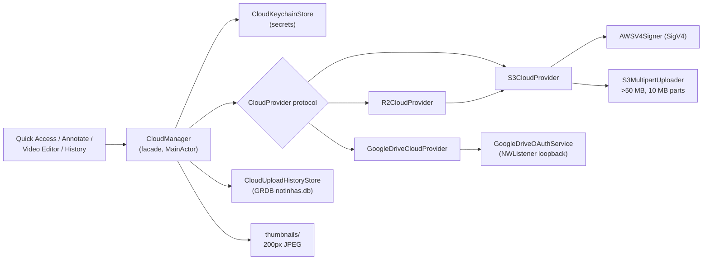

# Cloud Uploads

Bring-your-own-storage cloud uploads for captures: AWS S3, Cloudflare R2, Google Drive. No Notinhas servers, no telemetry — files go straight from the Mac to the user's bucket/drive.

Verified against `Notinhas/Services/Cloud/`, `Notinhas/Features/Preferences/Components/PreferencesCloud*.swift`, and upload call sites at HEAD (`v1.30.0-beta.4`).

## Current state (as of `dd4ccd5`)

- The after-capture **auto-upload** preference (`AfterCaptureAction.uploadToCloud`) was removed at `dd4ccd5`.
- Uploads are **manual-only**, from:
  - **Quick Access card** — `.uploadToCloud` action, default `bottomTrailing` slot (`QuickAccessActionKind.defaultAssignments`).
  - **Annotate** — bottom-bar button + ⌘U (`AnnotateShortcutManager.defaultCloudUpload`); re-upload on save/copy uploads the new render, then deletes the old cloud object in the background (`AnnotateWindowController`, `oldCloudKey` cleanup).
  - **Video Editor** — bottom-bar button (label flips to "Re-upload" once a `cloudKey` exists; overwrite path) + post-export upload offer via `.videoEditorCloudUpload` notification (`VideoEditorWindowController` guards).
  - **History** — context menu (`HistoryContextMenu`, gated on `CloudManager.shared.isConfigured`).
- Editor/card entry points are gated on `CloudManager.shared.isConfigured` **and** `QuickAccessActionConfigurationStore.shared.isEnabled(.uploadToCloud)` (Quick Access action customization can hide the action).

## Provider architecture

- `CloudProvider` protocol (`CloudProvider.swift`): `upload(fileURL:contentType:expireTime:existingKey:progress:)`, `generatePublicURL(for:)`, `delete(key:)`, `setExpiration(days:)`, `removeExpiration()`, `validate()`.
- `S3CloudProvider`: pure-Foundation SigV4 signing (`AWSV4Signer`), path-style URLs, multipart above 50 MB (`S3MultipartUploader.multipartThreshold`, 10 MB parts), optional custom domain for public URLs. Objects under `notinhas/` prefix; lifecycle rule ID `notinhas-auto-expire`.
- `R2CloudProvider`: thin wrapper over S3 with `region = "auto"` and the account endpoint.
- `GoogleDriveCloudProvider`: OAuth desktop flow via `GoogleDriveOAuthService` (NWListener loopback on `127.0.0.1`), uploads into a named folder (default `Notinhas`, cached folder ID), multipart for ≤5 MB else resumable, sets anyone-with-link reader permission. Lifecycle/expiration **unsupported** (`setExpiration`/`removeExpiration` are no-ops) → expire time forced to permanent for this provider.
- `CloudManager` (`CloudManager.swift`): facade — non-secret config in UserDefaults (`cloud.*` keys), secrets in Keychain, upload orchestration with `isUploading`/`uploadProgress`, history record insert, thumbnail generation (200 px max-dimension JPEG in `Application Support/Notinhas/thumbnails/<recordUUID>.jpg`; video uploads get frame thumbnails).

## Credentials & secrets

- `CloudKeychainStore`: service `com.trongduong.notinhas.cloud`; items `accessKey`, `secretKey`, `passwordHash`, `googleRefreshToken`, `googleClientId`, `googleClientSecret`, `imgbbAPIKey`. Legacy service `com.notinhas.cloud` auto-migrated. Data-protection keychain primary, file (legacy) keychain fallback when `errSecMissingEntitlement`.
- Protection password (`CloudPasswordService`): optional; SHA-256 hash in Keychain; min 4 characters; gates Edit / Import / Export of the config. Forgot password → reset configuration (`cloudPasswordEnabled` / `cloudPasswordSkipped` flags).
- Encrypted transfer archives (`CloudCredentialTransferService`): `.notinhascloud` files — AES-GCM-256 with PBKDF2-SHA256 key derivation, 300,000 iterations; passphrase ≥ 12 characters. ImgBB credentials are intentionally excluded from this archive format.

## ImgBB image sharing (Preferences → Cloud)

- Separate from bucket storage providers and Cloud Upload History.
- Manual uploads only from Annotate and Quick Access; link copy behavior is unchanged.
- API key stored in Keychain via `NotinhasImgBBCredentialStore`; legacy `notinhas.imgbb.apiKey` UserDefaults migrates on read.
- Cloud storage reset does not clear ImgBB; clearing the ImgBB key is explicit in the Image Sharing section.
- Protected edit/clear reuses the existing Cloud protection password when one is set.

## Configuration UI (Settings → Cloud)

`PreferencesCloudSettingsView.swift` (+ import/export sheets):

- Provider picker (AWS S3 / Cloudflare R2 / Google Drive).
- S3/R2: access key + secret key, bucket, region (S3) or endpoint (R2), optional custom domain.
- Google Drive: client ID + secret + OAuth authorize, folder name.
- Expire time: 1/3/7/14/30/60/90 days or **permanent** (`CloudExpireTime`). Non-permanent writes the bucket lifecycle rule `notinhas-auto-expire` on the `notinhas/` prefix (`CloudManager.applyLifecycleRule`); permanent warns and removes the rule. Google Drive forced to permanent.
- Optional protection password on save.
- Save & Test: `validate()` credentials before persisting.
- Configured state: masked summary (access key masked, "stored securely in Keychain") + Edit (password-gated) / Import / Export (`.notinhascloud`) / Reset.
- Usage stats grid (`CloudUsageService`): ListObjectsV2 scan of the `notinhas/` prefix, 10-minute cache (`cloud.usageStatsCache`), monthly cost estimates — R2 $0.015/GB (10 GB free), S3 $0.023/GB (5 GB free); skipped for Google Drive.
- Uploads window position pref: `cloud.uploads.floatingPosition` (`CloudUploadFloatingPosition`).
- Image Sharing / ImgBB section: API key setup, masked status, password-gated edit/clear; available even when no storage provider is configured.

## Cloud Uploads window

- `CloudUploadHistoryWindowController` (`PreferencesCloudUploadHistoryView.swift`): 1040×680 floating panel (`panelSize`).
- Open via: menu bar → Cloud Uploads (enabled only when `CloudManager.isConfigured`), ⇧⌘L, `notinhas://open/cloud-uploads`.
- Browse / search / filter (status active-expired, provider, expire time) / sort.
- Per-card actions: copy link, open URL, delete (`CloudManager.deleteFromCloud` — deletes cloud object + history record + thumbnail).
- Clear-all: **Delete from cloud and clear** vs **Clear history only**.
- No upload button inside the window — uploads originate from capture surfaces only.

## Upload history storage

- GRDB `notinhas.db` via `CloudUploadHistoryStore`; table `cloudUploadRecord` (migration `v1_createCloudUploadRecords` in `DatabaseManager`).
- `CloudUploadRecord` fields: `id` (UUID), `fileName`, `publicURL`, `key`, `fileSize`, `uploadedAt`, `providerType`, `expireTime`, `contentType?`.
- Derived: `isExpired` (local check from `expireTime.seconds`), `isImageType`, `thumbnailURL`.

## Security boundaries

- Secrets never leave the Keychain except via explicit, passphrase-encrypted `.notinhascloud` export.
- TOML config export excludes secrets — see [CONFIGURATION.md](CONFIGURATION.md).
- Public URLs are bearer links (custom domain / presigned-style path); deletion requires the stored credentials.

## Related docs

- [PREFERENCES.md](PREFERENCES.md) — Cloud tab + after-capture matrix (auto-upload removal)
- [SHORTCUTS.md](SHORTCUTS.md) — ⇧⌘L and `notinhas://open/cloud-uploads`
- [QUICK_ACCESS.md](QUICK_ACCESS.md) — card action slots
- [ANNOTATE.md](ANNOTATE.md) — ⌘U upload + re-upload flow
- [VIDEO_EDITOR.md](VIDEO_EDITOR.md) — editor upload + post-export offer
- [HISTORY.md](HISTORY.md) — context-menu uploads
- [UPDATES.md](UPDATES.md) — diagnostics (cloud category logging)
- [CONFIGURATION.md](CONFIGURATION.md) — TOML export excludes secrets
