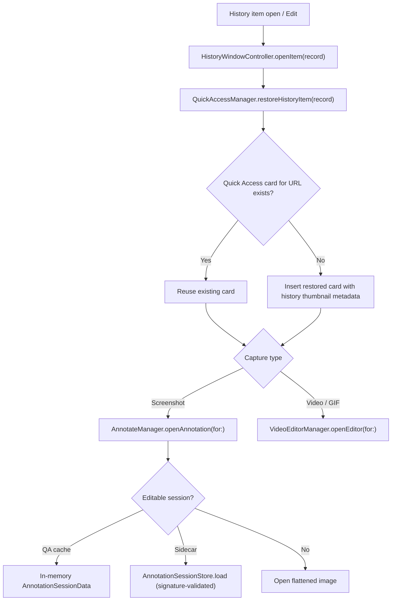

# Capture History

Persistent history of screenshots, videos, and GIFs backed by GRDB SQLite, surfaced through a floating panel (compact carousel + expanded grid) and a restore-to-Quick-Access flow that reopens captures in Annotate or Video Editor with editable sessions. Code: `Notinhas/Features/History/` + `Notinhas/Services/History/`.

## Entry Points

- Status bar menu (Capture History).
- Deep link `notinhas://open/history` (aliases `history`, `capture-history`).
- Global shortcut `GlobalShortcutKind.history`, default ⌘⇧H (`ShortcutConfig.defaultHistory`), rebindable in Preferences → Shortcuts.

## Floating Panel

- `HistoryFloatingManager` — panel state. Modes `compact` / `expanded`; position `topCenter` / `bottomCenter` (`HistoryPanelPosition.center` exists for config import, not in UI); panel scale 0.8–1.4 (`history.floating.scale`); `maxDisplayedItems` default 10; background `HistoryBackgroundStyle` hud / solid; toggle-mode shortcut default ⌘E (`defaultToggleModeShortcut`).
- `HistoryFloatingPanel` keyboard: ⌘C copy selection, ⌘A select all, ⌫ delete, Return open (all suppressed while text input active).
- Compact: type filter pills + horizontal `HistoryCompactCarouselView` cards.
- Expanded: type pills + filename search (150ms debounce, `HistorySearchViewModel`) + time filters all / 24H / 7D / 30D (`HistoryFloatingTimeFilter`) + 4-column grid + multi-select + selection bar + custom `HistoryFloatingScrollbar`.

## Card Actions

- Context menu (`HistoryContextMenu`): Open in Finder, Copy, Edit, Upload to Cloud (only when `CloudManager.isConfigured`; live overlay states via `HistoryCloudUploadOverlayView`), Delete — destructive last.
- Double-click opens the editor; cards expose a Restore pill.
- Cloud upload here is manual; commit `dd4ccd5` removed only the after-capture auto-upload preference option, not this surface.

## Restore Flow

- Sidecar package format and signature validation: see [ANNOTATE.md](ANNOTATE.md#session-sidecars).
- Restored saves follow the same Quick Access session behavior as fresh captures; already-saved files expose Open in the save/open slot.

## Storage

- Database: GRDB SQLite at `~/Library/Application Support/Notinhas/notinhas.db` via `DatabaseManager` (`Services/Cloud/`). Migrations: `v1_createCloudUploadRecords`, `v2_createCaptureHistoryRecords`. Launch repair/reset recovery archives db files to `DatabaseRecovery-<timestamp>/`.
- `CaptureHistoryStore` — GRDB `ValueObservation` publishes records; `add` is a no-op when `history.enabled` is off; `updateFilePath` (temp→export move), `markFileChanged`, `hasRecord(forFilePath:)`, `removeByFilePath`.
- Media files: temp captures live in Application Support temp root; saved captures in the user export folder — history only records paths.
- Thumbnails: `HistoryThumbnailGenerator` — JPEG, max dimension 208, stored in `HistoryThumbnails/`; `NSCache` memory cache 160 items / 48MB.

## Retention

- `CaptureHistoryRetentionService` — sweep at launch + every 24h timer.
- Prefs: `history.retentionDays` (default 30, 0 = forever), `history.maxCount` (default 500, 0 = unlimited).
- Sweep deletes: records older than retention, count-overflow records, unreferenced temp files, orphan thumbnails, orphan annotation sidecars (source gone / no active record / signature mismatch).
- `clearAllHistory()` deletes records + thumbnails + sidecars but keeps capture files on disk.
- `history.floating.autoClearDays` is persisted/exported but never consumed — dead setting.

## Temp File Interplay

- Launch `TempCaptureManager.cleanupOrphanedFiles` skips files referenced by active history records and keeps recent temp files while history is enabled (retention window); retention owns their eventual deletion.
- Quick Access dismiss deletes the temp file unless a history record exists; Quick Access delete removes the record first so the temp file actually goes away.

## Preferences Surface

Settings → History: enable toggle, floating panel (position, scale, max items, background, toggle-mode shortcut), display, retention days / max count, storage info. See [PREFERENCES.md](PREFERENCES.md).

## Dead / Legacy Code

Unused (kept in tree): `HistoryMainView` (except `HistoryBackdropView`, still used by the floating panel + preferences + cloud history), `HistoryItemView`, `HistoryToolbar`, `HistoryFilterBar`, `HistoryGridView`. Live card views are `HistoryCardView` / `HistoryExpandedCaptureCardView` / `HistoryCompactCarouselView`.

## Related docs

- [QUICK_ACCESS.md](QUICK_ACCESS.md) — restore target and card lifecycle
- [ANNOTATE.md](ANNOTATE.md) — editable session restore, sidecar format
- [VIDEO_EDITOR.md](VIDEO_EDITOR.md) — video/GIF restore target
- [POST_CAPTURE.md](POST_CAPTURE.md) — where history records are created
- [CLOUD.md](CLOUD.md) — upload records sharing `notinhas.db`
- [PREFERENCES.md](PREFERENCES.md) — settings keys
