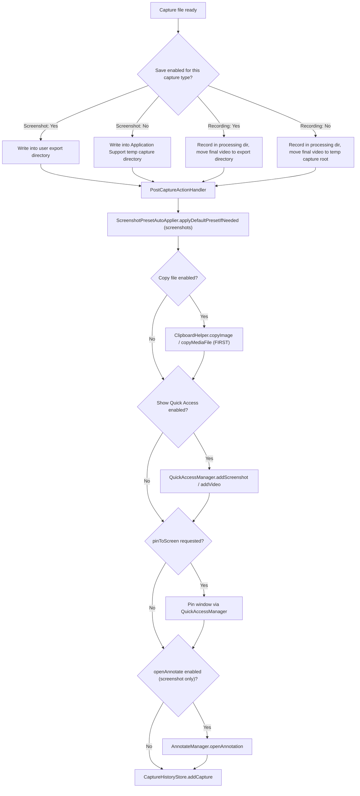

# Post-Capture Routing

Post-capture routing is everything that happens after a capture file exists: destination selection, clipboard copy, Quick Access handoff, annotate auto-open, and history recording. This doc covers `PostCaptureActionHandler`, `TempCaptureManager`, and their supporting services as of HEAD.

## Trigger Wiring

- Screenshots: `ScreenCaptureManager` emits every saved file URL on `captureCompletedPublisher` (sent from `saveImage(...)` when `emitCompletion` is true). The single subscription lives in `ScreenCaptureViewModel`'s init (`Notinhas/Features/Capture/CaptureViewModel.swift`) and calls `PostCaptureActionHandler.handleScreenshotCapture(url:)`.
- Batch screenshots (multi-display fullscreen) call `handleScreenshotCaptures(urls:)` directly from the capture flow instead of the publisher.
- Recordings: `RecordingCoordinator` calls `handleVideoCapture(url:)` after the writer finishes and the file is moved to its destination; the GIF flow calls `handleVideoCapture(url:skipQuickAccess: true)` after conversion because the placeholder card was already inserted. See [`RECORDING.md`](RECORDING.md).
- **OCR exception**: Capture Text is the only capture path that writes no file — recognized text/QR payloads go straight to the pasteboard as plain text, so no post-capture routing runs. See [`CAPTURE.md`](CAPTURE.md).
- Scrolling capture saves through `saveProcessedImage`, so it enters routing through the same publisher as any screenshot. See [`SCROLLING_CAPTURE.md`](SCROLLING_CAPTURE.md).

## After-Capture Action Matrix

`AfterCaptureAction` (`Notinhas/Features/Preferences/PreferencesManager.swift`) has 4 cases as of HEAD, each gated per `CaptureType` (`.screenshot`, `.recording`):

| Action | Screenshot default | Recording default | Effect |
| --- | --- | --- | --- |
| `save` | ON | ON | Chooses export directory vs temp capture directory |
| `showQuickAccess` | ON | ON | Adds a card to the Quick Access stack |
| `copyFile` | ON | ON | Copies file/image to the pasteboard |
| `openAnnotate` | OFF (screenshot only) | n/a | Auto-opens the Annotate editor |

- The matrix is stored as `[AfterCaptureAction: [CaptureType: Bool]]` JSON-encoded in `UserDefaults` under the `afterCaptureActions` key via `PreferencesManager`; unset entries fall back to the defaults above. See [`PREFERENCES.md`](PREFERENCES.md).
- `AfterCaptureAction.uploadToCloud` was **removed** at commit `dd4ccd5` (with its TOML key `upload_to_cloud`). Cloud upload is now manual-only: Quick Access cards, Annotate, Video Editor, and History surfaces, gated on `CloudManager.isConfigured` plus the `uploadToCloud` Quick Access action configuration. Nothing in `PostCaptureActionHandler` auto-uploads. See [`CLOUD.md`](CLOUD.md) and [`CONFIGURATION.md`](CONFIGURATION.md).

## Execution Order

`executeActions(for:url:skipQuickAccess:pinToScreen:)` runs on the main actor in a deliberate order:

1. **Scoped file access** — `SandboxFileAccessing.beginAccessingURL(url)` wraps the whole sequence (security-scoped bookmark access for files outside the container); missing files bail out with a diagnostic log.
2. **Preset auto-apply (screenshots)** — `ScreenshotPresetAutoApplier.applyDefaultPresetIfNeeded(to:)` checks the default Annotate canvas preset; when it changes the canvas it renders effects through the lightweight `AnnotateExporter.renderCanvasEffects(sourceImage:effects:)` path (no full `AnnotateState`), atomically rewrites the screenshot file, and returns `AnnotationSessionData` which is persisted via `AnnotationSessionStore` and cached on the Quick Access item so the capture reopens editable. See [`ANNOTATE.md`](ANNOTATE.md).
3. **copyFile FIRST** — clipboard copy runs before any thumbnail generation, overlay presentation, or editor work so auto-copy is never blocked by slower UI actions.
4. **showQuickAccess** — `QuickAccessManager.addScreenshot(url:)` / `addVideo(url:)`; skipped when `skipQuickAccess` is true (GIF two-step flow).
5. **pinToScreen** — optional caller flag (inline annotate Pin): pins the existing Quick Access item or pins directly from URL.
6. **openAnnotate** — screenshots only; opens through `AnnotateManager` with the Quick Access item when one exists, otherwise from the URL with preset session data.
7. **History record** — screenshots read pixel dimensions via `CGImageSource`; videos read duration and track `naturalSize` via `AVURLAsset` (macOS 15 async load APIs with older fallbacks); `.gif` extension maps to the GIF history type.

Batch variant `handleScreenshotCaptures(urls:)`: filters missing files, delegates single-URL batches to the normal path, auto-applies presets per file, copies all file URLs at once (`ClipboardHelper.copyFileURLs`), adds every file to Quick Access, opens only the **first** capture in Annotate, and records each file in history.

`copyEditedCaptureToClipboardIfEnabled(for:url:)` re-runs the clipboard automation after an in-place edit save (Annotate/Video Editor) when `copyFile` is enabled for that capture type.

## Destination Logic

- `AfterCaptureAction.save` is **not** a post-write callback:
  - **Screenshots**: `TempCaptureManager.resolveSaveDirectory(for:exportDirectory:)` decides the destination **before** the write — export directory when ON, temp directory when OFF.
  - **Recordings**: the AVAssetWriter always writes into a per-session `Captures/RecordingProcessing/<UUID>/` directory first (`TempCaptureManager.makeRecordingSavePlan`); after the writer finishes, the final video moves to the export directory (Save ON) or the temp capture root (Save OFF) and the processing directory plus writer sidecars are deleted. A failed final move falls back to a unique name in the temp root (`makeRecoveredRecordingURL`).
- **Export directory**: `SandboxFileAccessManager.resolvedExportDirectoryURL()` resolves the stored security-scoped bookmark (removing invalid bookmarks), falling back to a default location; first-use flows prompt through `ensureExportDirectoryForOperation(promptMessage:)`. See [`PREFERENCES.md`](PREFERENCES.md).
- **Temp directory**: `~/Library/Application Support/Notinhas/Captures/` — Application Support, deliberately not `/tmp`, so macOS never purges temp files mid drag-and-drop and paste-time reads stay valid.
- **Saving a temp capture later** (Quick Access Save action): `TempCaptureManager.saveToExportLocation(tempURL:)` moves the file into the export directory **preserving its relative path** (naming-template subfolders survive), moves the recording metadata sidecar for videos, and prunes emptied temp subdirectories.
- **Deletion**: `deleteTempFile(at:)` removes the file plus its recording metadata sidecar and prunes empty directories.
- **Launch cleanup**: `cleanupOrphanedFiles()` (called from `NotinhasApp` init) sweeps the temp directory but preserves files that have an active history record, and — while history is enabled — files still inside the retention window or files it cannot reconcile against the database; retention sweeps and explicit cache clearing are the mechanisms that actually delete those.

## Output Formats and Naming

- `ImageFormat` (`Notinhas/Services/Capture/ScreenCaptureManager.swift`): `.png`, `.jpeg(quality:)`, `.webp`; extensions `png` / `jpg` / `webp`.
- PNG/JPEG write through `CGImageDestination` with DPI metadata set to `scaleFactor × 72` (PNG also gets pixels-per-meter); JPEG carries `kCGImageDestinationLossyCompressionQuality`.
- WebP writes through `WebPEncoderService` (`Notinhas/Services/WebPEncoder.swift`, libwebp via Swift-WebP): `.photo` preset, `method = 1`, multithreaded, atomic file write.
- All screenshot outputs use a **minimum 2x pixel-density baseline** (`minimumScreenshotOutputScaleFactor`); low-density external-display captures are promoted before saving so fullscreen, area, scrolling, cutout, and inline-annotated screenshots match Retina output.
- Naming goes through `CaptureOutputNaming` (`Notinhas/Services/Capture/CaptureOutputNaming.swift`):
  - Default templates: `Notinhas_{datetime}_{ms}` (screenshot), `Notinhas_Recording_{datetime}` (recording), overridable per kind in Settings.
  - Tokens: `{datetime}`, `{date}`, `{year}`, `{yearShort}`, `{month}`, `{monthName}`, `{monthShort}`, `{day}`, `{time}`, `{ms}`, `{timestamp}`, `{type}`, `{appName}` plus snake/short aliases; `{appName}` resolves from the captured app (or frontmost app for fullscreen/area) and is empty when unavailable.
  - `/` creates sanitized subfolders under the destination; traversal segments and invalid path characters are stripped; known media extensions embedded in templates are removed.
  - `makeUniqueFileURL` dedupes with `_2`, `_3`, … suffixes.

## Clipboard Behavior

`Notinhas/Services/Clipboard/ClipboardHelper.swift` writes one pasteboard item per capture so receiving apps pick their preferred representation:

- `copyImage(from:)` — `writeObjects([NSURL])` (grants the receiver a sandbox extension), then augments the same item with the encoded data type (`.png`/JPEG/WebP UTI) and `.tiff` pixel data. When `NSImage` cannot decode the file (e.g. WebP on macOS 13), the item still carries the file URL and original encoded bytes.
- `copyMediaFile(from:)` — videos/GIFs: file-URL write plus same-item `.URL` and `.string` fallbacks for Teams/Electron/WebView paste targets.
- `copyFileURLs(_:)` — batch file-URL copy for multi-display screenshot sets.
- Render-based `copyImage(_:format:)` — Annotate/Mockup copies render to the configured format, write a temp file (`Notinhas_clipboard_<uuid>`), then copy like a file.
- Temp files must **not** be deleted after copying: receivers read them at paste time. Orphans are reclaimed by `cleanupOrphanedFiles()` on the next launch.

## Quick Access Handoff

- Quick Access cards expose hover actions and a matching context menu (copy, save/open, edit, cloud upload, dismiss, delete/trash); temp captures show Save, saved captures keep Open in the same slot even when the after-capture Save preference is off. Action visibility, order, and card slots come from `QuickAccessActionConfigurationStore`. See [`QUICK_ACCESS.md`](QUICK_ACCESS.md).
- Card countdowns **pause** while the item is being edited (Annotate/Video Editor), converted to GIF, or uploaded to cloud, and resume when the activity ends.
- GIF output is a two-step flow: record video → placeholder Quick Access card → `GIFConverter` → card URL swapped to the GIF → `handleVideoCapture(skipQuickAccess: true)` finishes routing. See [`RECORDING.md`](RECORDING.md).
- Screenshot pin opens an independent always-on-top pin window (zoom, drag-to-app, click-through lock mode). See [`QUICK_ACCESS.md`](QUICK_ACCESS.md).

## Cache and Storage Management

- `CaptureStorageManager` (`Notinhas/Services/FileAccess/CaptureStorageManager.swift`) owns the `Application Support/Notinhas/Captures` cache: `calculateCacheSize()` (background enumeration) and `clearCache()`.
- The UI lives in **Settings → History** (`PreferencesHistorySettingsView`): shows the formatted cache size and offers cache clearing. `clearCache()` refuses to run while a capture or recording is in progress (`CacheCleanupError.operationInProgress`), removes every file in the captures directory (skipping locked files), and deletes matching history records and recording metadata sidecars. See [`HISTORY.md`](HISTORY.md).

## Key Files

| File | Responsibility |
| --- | --- |
| `Notinhas/Services/Capture/PostCaptureActionHandler.swift` | Post-capture action execution, ordering, batch handling, history records |
| `Notinhas/Services/Capture/TempCaptureManager.swift` | Save-vs-temp destination, recording save plan, temp lifecycle, orphan cleanup |
| `Notinhas/Services/Capture/ScreenCaptureManager.swift` | `captureCompletedPublisher`, `ImageFormat`, file writing, 2x output baseline |
| `Notinhas/Services/Capture/CaptureOutputNaming.swift` | Naming templates, context tokens, sanitization, unique dedupe |
| `Notinhas/Services/Capture/ScreenshotPresetAutoApplier.swift` | Default Annotate canvas preset bake-in during routing |
| `Notinhas/Services/WebPEncoder.swift` | libwebp-backed WebP encoding |
| `Notinhas/Services/Clipboard/ClipboardHelper.swift` | Format-aware single-item pasteboard writes |
| `Notinhas/Services/FileAccess/SandboxFileAccessManager.swift` | Security-scoped export-directory bookmarks and scoped access |
| `Notinhas/Services/FileAccess/CaptureStorageManager.swift` | Captures cache sizing and clearing (Settings → History) |
| `Notinhas/Features/Preferences/PreferencesManager.swift` | `AfterCaptureAction` matrix storage and defaults |

## Related docs

- [`CAPTURE.md`](CAPTURE.md) — capture modes that feed this pipeline
- [`SCROLLING_CAPTURE.md`](SCROLLING_CAPTURE.md) — long-screenshot save path into routing
- [`RECORDING.md`](RECORDING.md) — recording writer, GIF two-step flow
- [`QUICK_ACCESS.md`](QUICK_ACCESS.md) — card stack, actions, countdown, pin windows
- [`ANNOTATE.md`](ANNOTATE.md) — preset auto-apply and editable sessions
- [`HISTORY.md`](HISTORY.md) — history records, retention, cache clearing
- [`CLOUD.md`](CLOUD.md) — manual cloud upload entry points
- [`PREFERENCES.md`](PREFERENCES.md) — after-capture matrix and export folder settings
- [`CONFIGURATION.md`](CONFIGURATION.md) — TOML keys for after-capture actions
- [`LOCALIZATION.md`](LOCALIZATION.md) — ownership of post-capture copy
