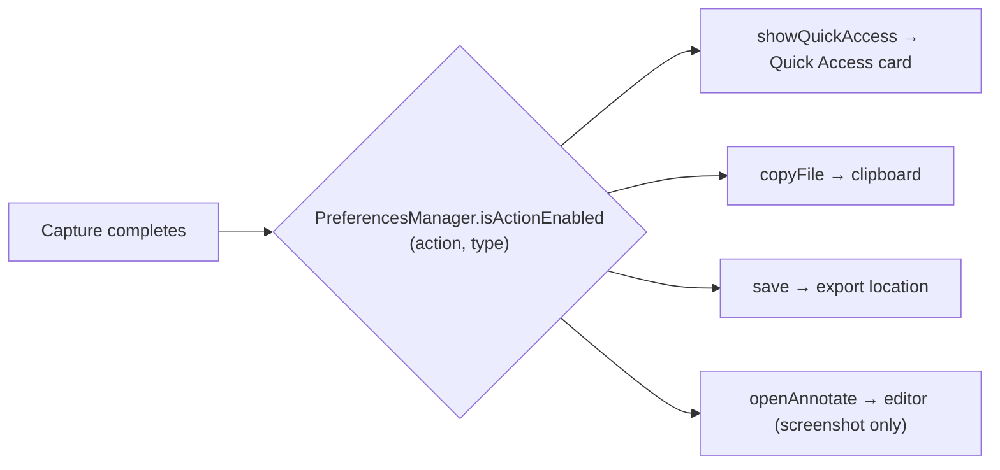

# Preferences

Reference for the Settings window: tab structure, every section, and how preferences are stored. Verified against `Notinhas/Features/Preferences/` at HEAD (`v1.30.0-beta.4`).

## Root

- `PreferencesView` (`Notinhas/Features/Preferences/PreferencesView.swift`) — SwiftUI `TabView`, fixed 760×550, nine tabs (no About/update/report tab).
- Selection driven by `PreferencesNavigationState.shared.selectedTab` (`Models/PreferencesNavigationState.swift`, `PreferencesTab` enum) — set programmatically from menu bar, deep links (`notinhas://settings?tab=`, see [SHORTCUTS.md](SHORTCUTS.md)), and the shortcut overlay.
- Presented through the `Settings` scene in `NotinhasApp`; activation-policy dance handled by `AppStatusBarController` (see [APP_LIFECYCLE.md](APP_LIFECYCLE.md)).

## Storage pattern

- Simple prefs: `@AppStorage(PreferencesKeys.*)` directly in views; keys centralized in `Notinhas/Features/Preferences/Models/PreferencesKeys.swift`.
- Complex structured prefs: `PreferencesManager.shared` (`PreferencesManager.swift`) behind the `PreferencesProviding` protocol (`PreferencesProviding.swift`) for DI.
- TOML export/import covers most prefs — see [CONFIGURATION.md](CONFIGURATION.md).

## Tabs

### General (`PreferencesGeneralSettingsView.swift`)

- **Startup**: Start at Login (`LoginItemManager` / SMAppService), Play Sounds (`playSounds`), Show Menu Bar Icon (`showMenuBarIcon`).
- **Appearance**: Language row (`PreferencesLanguageSettingRow`), theme picker (`AppearanceModePicker` → `appearanceMode`).
- **Storage**: Save Location (`exportLocation` + `exportLocation.bookmark`, via `SandboxFileAccessManager`).
- **Help**: Restart Onboarding (`OnboardingFlowView.resetOnboarding()` + `.showOnboarding`).

### Capture (`PreferencesCaptureSettingsView.swift`)

Segmented into three panes (`CaptureSettingsPane`): General / Screenshot / Recording.

- **General pane**:
  - App Windows: Include Notinhas windows in screenshots (`screenshot.includeOwnApp`) / in recordings (`recording.includeOwnApp`).
  - Desktop: Hide Desktop Icons (`hideDesktopIcons`), Hide Desktop Widgets (`hideDesktopWidgets`).
  - Overlay: Show Selection Area Overlay (`screenshot.showSelectionAreaOverlay`).
  - Magnifier: Reverse Magnifier Zoom Direction (`screenshot.reverseMagnifierZoomDirection`).
  - Output Naming: screenshot/recording file-name templates (`screenshot.fileNameTemplate`, `recording.fileNameTemplate`) with token list + live preview + reset.
  - After Capture: action matrix (see below) + Auto-Crop Subject (`backgroundCutout.autoCropEnabled`).
- **Screenshot pane**:
  - Format: Show Cursor (`screenshot.showCursor`), Freeze Area (`screenshot.freezeArea`), Image Format (`screenshot.format`, `ImageFormatOption`; WebP shows a warning, JPEG a cutout note).
  - Preset: default annotate canvas preset (`PreferencesScreenshotDefaultPresetPicker`).
  - Scrolling Capture: Show Session Hints (`scrollingCapture.showHints`) + info note.
  - OCR: Success Notification (`ocr.successNotificationEnabled`), Link Detection (`ocr.linkDetectionEnabled`).
- **Recording pane**:
  - Format: MOV / MP4 (`recording.format`).
  - Quality: Frame Rate 30/60 (`recording.fps`), Quality (`recording.quality`, `VideoQuality`).
  - Behavior: Show Cursor (`recording.showCursor`), Remember Last Area (`recording.rememberLastArea`).
  - Controls: Hover Bar Visible (`recording.hoverBarVisible`), Show Time on Menu Bar (`recording.showTimeOnMenuBar`).
  - Mouse Highlight: size 30–100, animation 0.3–2.0 s, ripple count 1–5, color (archived `NSColor` in `recording.mouseHighlight.color`), opacity 0.2–1.0; reset-to-default.
  - Keystroke Overlay: font size 12–32, position (`KeystrokeOverlayPosition`), display duration 0.5–5.0 s; reset-to-default.
  - Audio: System Audio (`recording.captureAudio`), Microphone (`recording.captureMicrophone`, runs `AVCaptureDevice` authorization flow with System Settings fallback), Mic Input device picker (`recording.microphoneDeviceID`).

### Annotate (`PreferencesAnnotateSettingsView.swift`)

- Behavior section only:
  - Sync Tool Defaults / quick-properties sync (`annotate.quickPropertiesSyncEnabled`, default on).
  - Combine Save-as-Edit (`annotate.combineSaveAsEdit`, default on).
  - Clipboard image open behavior (`annotate.clipboardImageOpenBehavior`): `ask` (default) / `loadAutomatically` / `doNothing` (`AnnotateClipboardImageBehavior`).
  - Close After Drag (`annotate.closeAfterDrag`, default on).
  - Bring Forward After Drag (`annotate.bringForwardAfterDrag`, default off; disabled when Close After Drag is on).

### Quick Access (`PreferencesQuickAccessSettingsView.swift`)

- **Actions**: `QuickAccessActionCustomizationView` — action enable/order/slot assignment with live preview card (`PreferencesQuickAccessPreviewCard`); keys `quickAccess.actions.*`, `quickAccess.swipe.action.*`.
- **Position**: screen edge left/right (`floatingScreenshot.position`).
- **Appearance**: overlay size slider 0.75–1.5 (`floatingScreenshot.overlayScale`).
- **Behaviors**: floating overlay enable (`floatingScreenshot.enabled`), Auto-Close toggle + 3–30 s slider (default 10, `floatingScreenshot.autoDismiss*`) + Pause on Hover, Hide Card When Window Open (`quickAccess.hideCardWhenWindowOpen`), Animation Style (`quickAccess.animationStyle`), Drag & Drop (`floatingScreenshot.dragDropEnabled`), Two-Finger Swipe to Dismiss + sensitivity 0.5–3.0 (`floatingScreenshot.twoFingerSwipe*`).
- **Trackpad Swipe Mode**: mode picker (`quickAccess.trackpad.swipe.mode`) + swipe-action hints; visible when swipe-to-dismiss is on.

### History (`PreferencesHistorySettingsView.swift`)

- **Floating Panel**: enable (`history.floating.enabled`), Panel Position (`history.floating.position`).
- **Display**: Default Filter (all/screenshots/videos/gifs), Background Style (`history.backgroundStyle`, thumbnail picker), Panel Size scale slider (`history.floating.scale`), Max Items 3–20 (`history.floating.maxDisplayedItems`).
- **Retention**: Retention Days 0–90, 0 = keep forever (`history.retentionDays`), Max Count 0–1000, 0 = unlimited (`history.maxCount`).
- **Storage**: capture storage size + Open Capture Storage (`CaptureStorageManager`), Clear History with confirmation (`HistoryWindowController.deleteRecords`).
- Master history enable (`history.enabled`) seeded on; see [APP_LIFECYCLE.md](APP_LIFECYCLE.md) for seeded defaults.

### Shortcuts (`PreferencesShortcutsSettingsView.swift`)

- Master toggle (`shortcutsEnabled`).
- Grouped recorders with per-shortcut enable toggles and per-section Reset: Capture, Recording, Tools, History, Quick Access, Annotate Actions, Annotate Tool Keys; Reset to Defaults (all).
- System-conflict guidance via `SystemScreenshotShortcutManager`.
- Full mechanics and default bindings: [SHORTCUTS.md](SHORTCUTS.md).

### Permissions (`PreferencesPermissionsSettingsView.swift`)

- Rows with status labels + System Settings deep links:
  - Screen Recording → `Privacy_ScreenCapture`
  - Save Folder → `Privacy_FilesAndFolders`
  - Microphone → `Privacy_Microphone`
  - Accessibility → `Privacy_Accessibility`
- Shows `grantedButUnavailableDueToAppIdentity` when `AppIdentityManager` reports issues (see [APP_LIFECYCLE.md](APP_LIFECYCLE.md)).

### Cloud (`PreferencesCloudSettingsView.swift`)

Provider configuration, credentials, expiration, usage stats, and the Cloud Uploads window. Summary only here — full reference in [CLOUD.md](CLOUD.md).

### Advanced (`PreferencesAdvancedSettingsView.swift`)

- **Backup**: TOML Import / Export / Restore Defaults (`NotinhasConfiguration*` services).
- **Configuration File**: grant access to `~/.config/notinhas`, Sync Now, Open Config, status/issues — see [CONFIGURATION.md](CONFIGURATION.md).
- **Integration**: URL Scheme toggle (`urlSchemeEnabled`).
- **Diagnostics**: enable toggle (`diagnostics.enabled`), retention days (`diagnostics.retentionDays`, default 3, range 1–30 via `LogCleanupScheduler`), Open Folder (`~/Library/Logs/Notinhas`) — see [UPDATES.md](UPDATES.md).

## After-capture matrix

- `AfterCaptureAction` (4 cases) × `CaptureType` (2: screenshot, recording) — defined in `PreferencesManager.swift`.
- Defaults: `showQuickAccess`, `copyFile`, `save` = on for both types; `openAnnotate` = off (opt-in, screenshot-only).
- Stored as JSON `[String: [String: Bool]]` under UserDefaults key `afterCaptureActions`; load failures fall back to seeded defaults.
- Edited via `PreferencesAfterCaptureMatrixView.swift` (Capture → General pane).
- **Removed at `dd4ccd5`**: the `uploadToCloud` after-capture auto-upload case no longer exists. Manual cloud uploads remain (Quick Access, Annotate ⌘U, Video Editor, History) — see [CLOUD.md](CLOUD.md).

## Related docs

- [SHORTCUTS.md](SHORTCUTS.md) — shortcut mechanics, defaults, conflicts
- [CLOUD.md](CLOUD.md) — Cloud tab + uploads window
- [UPDATES.md](UPDATES.md) — local diagnostics and manual upgrade notes
- [APP_LIFECYCLE.md](APP_LIFECYCLE.md) — seeded defaults, activation policy, onboarding
- [CONFIGURATION.md](CONFIGURATION.md) — TOML backup/sync of these prefs
- [QUICK_ACCESS.md](QUICK_ACCESS.md) — overlay behavior details
- [HISTORY.md](HISTORY.md) — retention and storage internals
