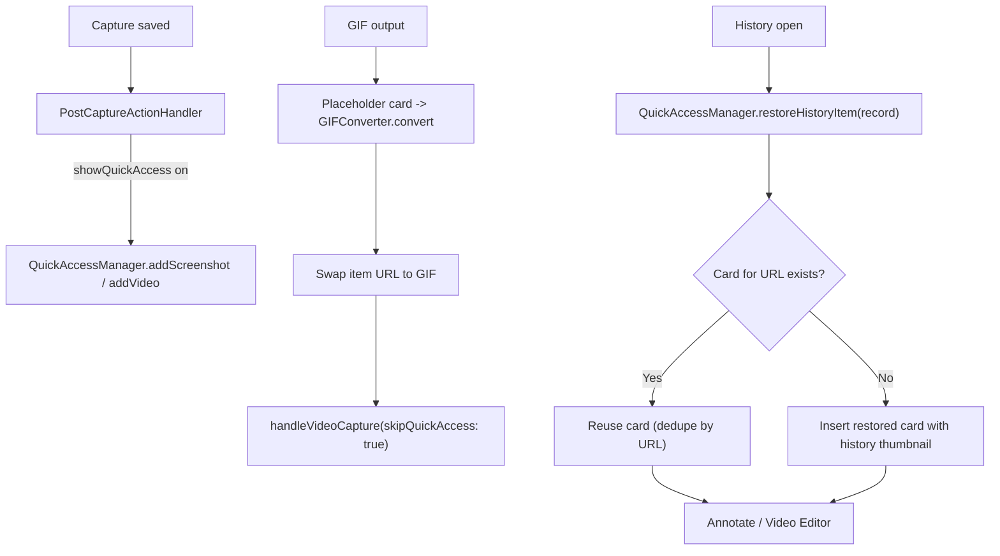

# Quick Access

Floating post-capture card stack: appears after every screenshot/video/GIF when the `showQuickAccess` after-capture action is on, offering hover actions, gestures, countdown auto-dismiss, pin windows, and the entry point into Annotate / Video Editor / cloud upload. Code lives in `Notinhas/Features/QuickAccess/`.

## Panel

- `QuickAccessPanel` — borderless `.nonactivatingPanel` NSPanel at `.floating` level; mouse-passthrough outside the card region (`updatePassthroughRegion`, `ignoresMouseEvents` toggled by hit-test).
- Show/hide transitions (`QuickAccessPanelController`) cannot wedge: a `show()`/`hide()` landing mid-transition force-closes the superseded panel instead of being dropped, and a watchdog force-completes any transition whose `NSAnimationContext` completion handler is dropped by AppKit (token-guarded, first finish wins). `QuickAccessManager` re-ensures the panel on every added card (`showPanelIfNeeded`), so a desynced panel self-heals on the next capture.
- `QuickAccessManager` — singleton stack state; `maxVisibleItems = 5`, newest at top; oldest evicted when full.
- Mouse monitors suspended during area capture (`suspendForCapture()` → panel + pin windows). Resume reinstalls monitors and refreshes passthrough (`resumeAfterCapture()`).
- Self-heal: panel show and `isWindowOpen` transitions (editor open/close) call `reinstallMouseMonitors()` — macOS can silently disable the global event tap after a runloop stall, which otherwise leaves hover dead until monitors are recreated. Passthrough is refreshed after every reinstall.
- Hover re-prime: when a card remounts under a stationary pointer (`onAppear` after Annotate close), `QuickAccessCardView` async-checks whether the mouse is over the card frame and seeds `isHovering` plus countdown pause without requiring a large mouse move; a scoped synthetic `.mouseMoved` nudges AppKit tracking areas.
- Slide-in animation: spring 0.4s (`QuickAccessAnimations.panelEnter`, damping 0.75); falls back to fade under reduceMotion. Appear sound via `QuickAccessSound`.
- Card hide/reappear (editor open/close) is driven by a SINGLE animation source: `QuickAccessStackView.animation(value: visibleItems.count)` — `QuickAccessManager.setWindowOpen` deliberately does NOT wrap its mutation in `withAnimation` (two compounding springs caused reappear jank).
- Position: 4-corner model `QuickAccessPosition`; prefs UI exposes left/right (bottom corners). Overlay scale 0.75–1.5 step 0.25 (`overlayScale`, scales `QuickAccessLayout` 180×112 base). Animation style slide/scale (`quickAccess.animationStyle`).

## Card Anatomy

- 180×112 pt base (`QuickAccessLayout.cardWidth/cardHeight`), scaled by overlay scale; 8pt spacing, stack scale/opacity falloff per card.
- `QuickAccessCardView` — thumbnail (`QuickAccessThumbnailGenerator`), duration badge for videos, pin indicator, progress overlays (`QuickAccessProgressView`): GIF conversion spinner/ring/check/fail and cloud upload states.
- Hover → dim + up to 2 center text buttons + up to 4 corner icon buttons (staggered reveal). Double-click opens the editor; right-click context menu mirrors actions, destructive group last.
- Assigned-but-unavailable actions (already-uploaded cloud, screenshot-only on video) stay visible disabled.

## Actions

`QuickAccessActionKind` (7, all live): `copy`, `saveOrOpen`, `dismiss`, `delete`, `edit`, `uploadToCloud`, `pinToScreen`.

Default slots (`QuickAccessActionSlot.defaultAssignments`): centerTop copy, centerBottom saveOrOpen, topTrailing dismiss, topLeading delete, bottomLeading edit, bottomTrailing uploadToCloud. `pinToScreen` unassigned by default.

| Action | Behavior |
| --- | --- |
| `copy` | Clipboard copy + dismiss; temp file kept on disk for paste-time reads (orphans cleaned next launch) |
| `saveOrOpen` | Temp: `TempCaptureManager.saveToExportLocation` move + history path update + sidecar move. Saved: reveal in Finder |
| `dismiss` | Card removed; temp file deleted unless a history record exists |
| `delete` | Removes history record + annotation sidecar, deletes temp or trashes saved file, deletes recording metadata for videos |
| `edit` | Opens Annotate (screenshots) or Video Editor (video/GIF); pauses countdown |
| `uploadToCloud` | Manual `CloudManager.upload`, copies public link, deletes old key on re-upload; gated by `CloudManager.isConfigured` |
| `pinToScreen` | Opens always-on-top pin window (screenshots only) |

Customization: `QuickAccessActionConfigurationStore` — context-menu order (`quickAccess.actions.order.v1`), enabled set (`...enabled.v1`), slot assignments (`...slots.v1`). Settings → Quick Access preview card supports drag-to-slot + swipe zones + reset. Note: commit `dd4ccd5` removed only the after-capture auto-upload preference option; the manual `uploadToCloud` card action stays, additionally gated by `isEnabled(.uploadToCloud)`.

## Gestures

`QuickAccessDraggableView`:

- Mouse drag: 30pt direction threshold; drag toward panel edge = swipe-dismiss; drag away = drag-to-app file drag.
- Two-finger trackpad swipe: `QuickAccessTrackpadSwipeHelpers`, dismiss at distance 80 / velocity 300, sensitivity 0.5–3.0 multiplier; mode natural/inverted (`quickAccess.trackpad.swipe.mode`, default inverted).
- Per-direction action assignment via `QuickAccessSwipeActionStore` (`quickAccess.swipe.action.left/right`, both default dismiss).

## Auto-Dismiss Countdown

- `autoDismissDelay` 3–30s, default 10; pause on hover `pauseCountdownOnHover` default on.
- Countdown pauses while editing / GIF-converting / cloud-uploading, resumes when work finishes (`pauseCountdownForEditingItem` pauses the edited item + all newer items).
- Pinned items bypass the countdown.

## Pin Windows

- `QuickAccessPinWindowManager` + `QuickAccessPinWindow` + `QuickAccessPinWindowState` — screenshots only, always-on-top.
- Zoom: pinch + ⌘-scroll; factor clamped between min(0.4 floor, raised to minimum-interactive-size 240×180) and max(`min(2, screenLimit)`), i.e. ≤2x; zoom preset capsule menu.
- Lock mode: click-through except the unlock button; image fades to 0.18 on hover. Esc closes when unlocked.
- Drag-out handle (`QuickAccessPinDragHandleView`) re-exports the current rendered image to `Captures/PinDrags/` — saved edits included even while file write is in flight.
- Closing unpins the QA item and restarts its countdown. Transient `pinScreenshot(url:)` supports pinning arbitrary files.

## Flow In

- See [POST_CAPTURE.md](POST_CAPTURE.md) for the routing matrix, [RECORDING.md](RECORDING.md) for the GIF swap, [HISTORY.md](HISTORY.md) for restore.
- Clipboard copy runs before Quick Access work so pasteboard updates stay immediate. Exception: the re-copy after an EDITED save runs off-main (decode/encode in background, serialized) and lands ~100-300ms after the window closes — keeps the card reappear stall-free.
- Save/copy/drag of a pinned screenshot pushes the new render into the open pin window as soon as the background render completes (~50-100ms after save-and-close). The instant 200px anti-flash thumbnail is card-only and is never sent to the pin window (pin sizing derives from the full-res image).

## Preferences Surface

Settings → Quick Access: position (left/right), overlay size, auto-close delay + pause on hover, two-finger swipe (mode, sensitivity, per-direction actions), action customization. See [PREFERENCES.md](PREFERENCES.md).

## Related docs

- [POST_CAPTURE.md](POST_CAPTURE.md) — after-capture routing into Quick Access
- [CAPTURE.md](CAPTURE.md) — capture flows producing cards
- [RECORDING.md](RECORDING.md) — GIF conversion placeholder swap
- [ANNOTATE.md](ANNOTATE.md) — edit action, sidecars, drag-to-app
- [VIDEO_EDITOR.md](VIDEO_EDITOR.md) — video/GIF editor entry
- [HISTORY.md](HISTORY.md) — restore-to-Quick-Access flow
- [CLOUD.md](CLOUD.md) — manual upload gating
- [PREFERENCES.md](PREFERENCES.md) — settings keys
