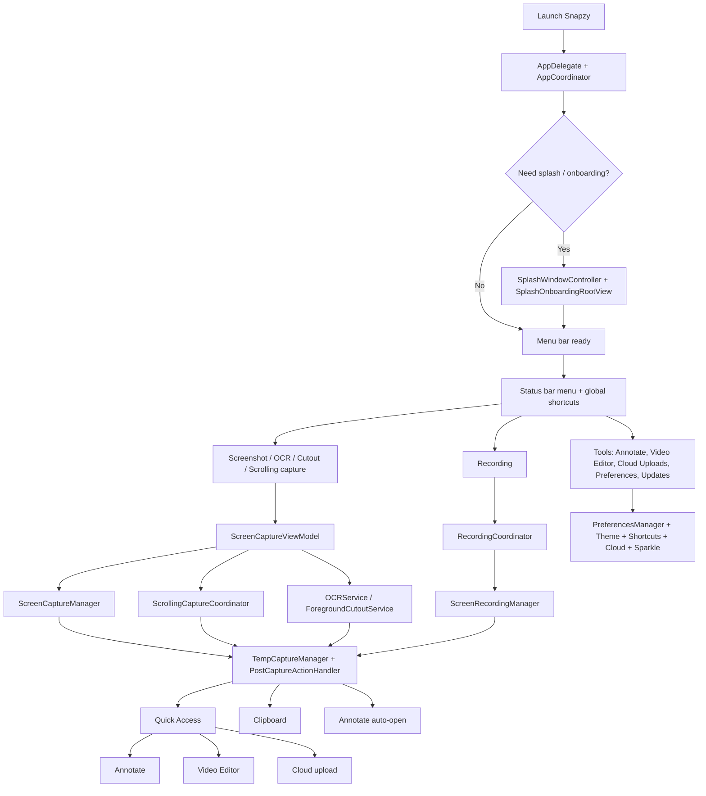

# Documentation Map

Flow-first entrypoint for humans and agents working in Snapzy.

## Read First

| Doc | Why it exists | Read when |
| --- | --- | --- |
| [`../README.md`](../README.md) | Public product summary, install, feature list | Any new session |
| [`DEVELOPMENT.md`](DEVELOPMENT.md) | First-time local setup and source-based development | Running from source |
| [`STRUCTURE.md`](STRUCTURE.md) | Real source-tree map, runtime architecture, edit guide | Any code change |
| [`LOCALIZATION.md`](LOCALIZATION.md) | Localization architecture for `Resources/Localization`, ownership rules, verification | Copy, UI text, alerts, onboarding, preferences |
| [`CAPTURE.md`](CAPTURE.md) | Feature flows for capture, scrolling capture, recording, post-capture, editors | Capture, media, UX work |
| [`BUILD.md`](BUILD.md) | Archive, export, and DMG packaging commands | Packaging, release prep |
| [`RELEASES.md`](RELEASES.md) | Release and appcast workflow | Shipping updates |
| [`UPDATE_TESTING.md`](UPDATE_TESTING.md) | Local Sparkle update test harness | Updater changes |
| [`SELF_SIGNED_CERT.md`](SELF_SIGNED_CERT.md) | Local signing setup | Update testing |

## Product Flow Map

## Agent Reading Order

- Capture, scrolling capture, recording: `STRUCTURE.md` -> `CAPTURE.md`
- Tests: `STRUCTURE.md` -> `DEVELOPMENT.md`
- Localization or user-facing copy: `STRUCTURE.md` -> `LOCALIZATION.md` -> `CAPTURE.md` when capture/editor UX is affected
- Onboarding, menu bar, preferences: `STRUCTURE.md`
- Cloud storage and upload UX: `STRUCTURE.md` + `CAPTURE.md`
- Build, release, updater: `DEVELOPMENT.md` -> `BUILD.md` -> `RELEASES.md` -> `UPDATE_TESTING.md`

## Current Behavior Notes

- `AfterCaptureAction.save` decides whether captures go straight to the export folder or into `~/Library/Application Support/Snapzy/Captures/` as temp files.
- `AfterCaptureAction.uploadToCloud` currently enables Quick Access cloud-upload entry points for screenshots, videos, and GIFs, plus Annotate cloud upload for screenshots. It is not executed directly by `PostCaptureActionHandler`.
- GIF recording flow first creates a video, inserts it into Quick Access, converts it, then swaps the card to the GIF output.
- Annotate and Video Editor temporarily elevate Snapzy from accessory mode to regular app mode so the editor windows appear in Dock and Cmd+Tab.
- Screenshot annotations that have been committed are persisted as sidecar packages in `Application Support/Snapzy/AnnotationSessions/`, so History restore can reopen editable annotations instead of only the flattened image.
- Annotation sidecars are cleaned with their source screenshots through Quick Access delete, History delete, clear-history, retention sweep, and temp-to-export save/move paths. They are not draft autosaves for unsaved Annotate windows during app quit.
- Full Annotate drag-to-app closes the editor by default. Settings → Annotate → `Close after drop` can be turned off to keep the editor session alive after sharing a rendered copy; `Reactivate after drop` controls whether that preserved editor is activated after drop.
- During recording, the menu bar item stays menu-first instead of left-click-to-stop. It shows the live timer, keeps Preferences reachable, and temporarily excludes the Settings window from own-app recordings when needed.

If one of these behaviors changes, update this file, [`STRUCTURE.md`](STRUCTURE.md), [`CAPTURE.md`](CAPTURE.md), and the root [`README.md`](../README.md) in the same change.
