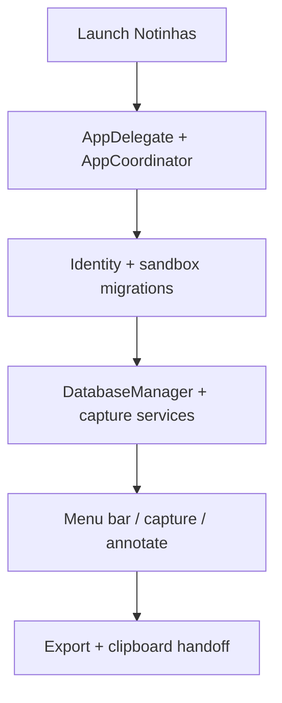

# Notinhas documentation map

Flow-first entrypoint for humans and agents working in Notinhas. Start here, then open the doc that owns your topic.

## Product focus

Notinhas optimizes **capture → annotate with numbered pins/notes → clipboard export**. Inherited upstream docs describe shared capture, history, and annotate machinery — keep them accurate when touching those flows.

## Quick links

| Doc | Topic |
| --- | --- |
| [MIGRATION.md](MIGRATION.md) | Upgrading from Snapzy, TCC re-grant, legacy paths |
| [DEVELOPMENT.md](DEVELOPMENT.md) | Clone, Xcode, `./scripts/build_and_run.sh` |
| [BUILD.md](BUILD.md) | Archive, DMG, bundle verification |
| [STRUCTURE.md](STRUCTURE.md) | Source tree and runtime ownership |
| [APP_LIFECYCLE.md](APP_LIFECYCLE.md) | Launch, onboarding, menu bar, migrations |
| [SHORTCUTS.md](SHORTCUTS.md) | Hotkeys and `notinhas://` automation |
| [PREFERENCES.md](PREFERENCES.md) | Settings tabs and storage keys |
| [CONFIGURATION.md](CONFIGURATION.md) | `~/.config/notinhas/config.toml` |
| [UPDATES.md](UPDATES.md) | Local diagnostics (no Sparkle) |
| [RELEASES.md](RELEASES.md) | GitHub Release / DMG workflow |
| [UPDATE_TESTING.md](UPDATE_TESTING.md) | Post-build verification |
| [SECURITY.md](SECURITY.md) | Engineering security notes |

## Capture and editors

| Doc | Topic |
| --- | --- |
| [CAPTURE.md](CAPTURE.md) | Screenshot flows |
| [SCROLLING_CAPTURE.md](SCROLLING_CAPTURE.md) | Scrolling capture |
| [RECORDING.md](RECORDING.md) | Screen recording (optional Video module) |
| [POST_CAPTURE.md](POST_CAPTURE.md) | After-capture routing |
| [QUICK_ACCESS.md](QUICK_ACCESS.md) | Floating post-capture card |
| [HISTORY.md](HISTORY.md) | Capture history |
| [ANNOTATE.md](ANNOTATE.md) | Annotation editor |
| [VIDEO_EDITOR.md](VIDEO_EDITOR.md) | Video editor (optional module) |

## Platform

| Doc | Topic |
| --- | --- |
| [CLOUD.md](CLOUD.md) | Cloud upload (optional) |
| [LOCALIZATION.md](LOCALIZATION.md) | String catalogs |

## Runtime overview

## Agent routing

- Notinhas pins/export → `.agents/skills/capture-annotate-export/SKILL.md`
- Build/test gates → `delivery-workflow`
- Repo policy → `project-standards` and root `AGENTS.md`

## Legacy compatibility note

Source and migration code may reference **legacy Snapzy** paths (`Snapzy/`,
`snapzy.db`, `snapzy://`) only for one-time import or rejection tests.
User-facing docs and automation should use **Notinhas** paths and
`notinhas://` unless explicitly documenting legacy migration inputs in
[MIGRATION.md](MIGRATION.md).
