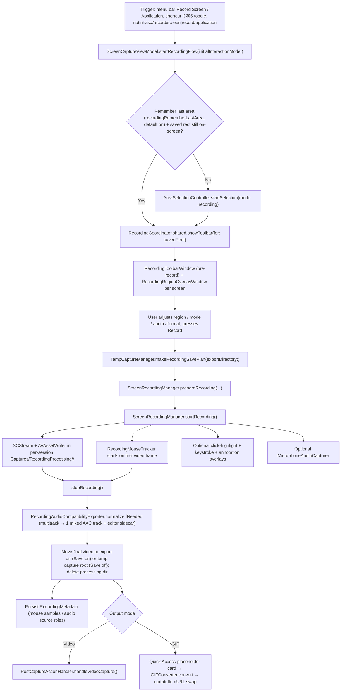

# Screen Recording, GIF Output, and Smart Camera Capture

This doc covers the runtime path for screen recording: trigger, pre-record toolbar, the `ScreenRecordingManager` media pipeline, pause/resume, audio, in-recording overlays, GIF conversion, and the Smart Camera metadata recorded for the video editor. Editing recorded videos lives in [`VIDEO_EDITOR.md`](VIDEO_EDITOR.md); screenshots and other capture modes live in [`CAPTURE.md`](CAPTURE.md).

## Recording Flow

- Entry points: menu bar items (`AppStatusBarController` → `viewModel.startRecordingFlow()` / `startApplicationRecordingFlow()`), global shortcut `GlobalShortcutKind.recording` (default `⇧⌘5`, start/stop toggle via `toggleRecordingFromShortcut`), and deep links `notinhas://record/screen` / `notinhas://record/application`. Application mode enters the same flow with `.applicationWindow` as the initial interaction mode.
- `ScreenCaptureViewModel.startRecordingFlow` (`Notinhas/Features/Capture/CaptureViewModel.swift`) hides own normal-level windows when own-app exclusion is on, then either restores the last area or runs an `AreaSelectionController` session in `.recording` mode.
- `RecordingCoordinator` (`Notinhas/Features/Recording/RecordingCoordinator.swift`) owns toolbar/overlay UX and stop/GIF handoff. `ScreenRecordingManager` (`Notinhas/Services/Capture/ScreenRecordingManager.swift`) owns media capture, timing, and metadata persistence.
- Remember-last-area: `RecordingCoordinator.saveLastAreaRect` persists the rect to `PreferencesKeys.recordingLastAreaRect` on selection/drag end; `loadLastAreaRect()` returns it only when it still intersects a connected `NSScreen`.

## Capture Modes

`RecordingCaptureMode` (`Notinhas/Features/Recording/Components/RecordingToolbarCaptureAreaToggle.swift`): `.area`, `.fullscreen`, `.application`.

- Mode changes re-run selection through `RecordingCoordinator.restartSelection(for:)` while preserving the current toolbar configuration (format, quality, audio flags, output mode, cursor/overlay toggles).
- `.application` carries a `WindowCaptureTarget`; the content filter becomes `SCContentFilter(display:including:)` with the target window plus excepted overlay windows. If the window vanishes from shareable content, the filter falls back to rect capture.
- The pre-record region overlay (`RecordingRegionOverlayWindow`, one per screen) supports cross-display drag/resize/reselect: `RecordingRegionOverlayView` installs local + global `NSEvent` monitors on gesture start and clamps movement to the unified desktop frame (union of all screen frames). `SCStream` still records a single `SCDisplay` — the display with the largest overlap wins (same rule as area screenshots). During a drag the coordinator takes a lightweight path (`updateOverlayHighlightsOnly`) and persists/repositions only on gesture end.

## Media Pipeline

- State machine: `RecordingState { idle, preparing, recording, paused, stopping }` (`@Published` on `ScreenRecordingManager`). `prepareRecording` requires `.idle`, `startRecording` requires `.preparing`, `stopRecording` requires `.recording` or `.paused`.
- Writer session: video goes to a per-session internal directory `Application Support/Notinhas/Captures/RecordingProcessing/<UUID>/` from `TempCaptureManager.makeRecordingSavePlan(exportDirectory:)`. On stop, the finished file is moved to the export directory (Save enabled) or the temp capture root (Save disabled), then the processing directory and AVAssetWriter sidecars are deleted. Failed final moves recover into the temp root (`makeRecoveredRecordingURL`); if that also fails the processing directory is preserved.
- Geometry: `resolveCaptureGeometry` clamps the selection to display bounds, pixel-aligns to the display's `backingScaleFactor`, flips to SCK's top-left `sourceRect`, and derives output dimensions at native scale. macOS 14.2+ uses `.best` capture resolution.
- `RecordingSession` (`Notinhas/Features/Recording/RecordingSession.swift`) is a thread-safe (`@unchecked Sendable`, `NSLock`) holder for the `AVAssetWriter` so `nonisolated` SCK callbacks never cross `@MainActor`. The writer session starts lazily at the first complete video frame's PTS (`startSession(atSourceTime:)`); audio/mic samples earlier than the first video frame are dropped. Backpressure drops are counted in `videoWriteStats` and logged on stop.
- Formats: `VideoFormat { mov, mp4 }` (mp4 sets `shouldOptimizeForNetworkUse`). Quality: `VideoQuality { high, medium, low }` with bits-per-pixel-per-frame 0.20/0.13/0.08, min/max bitrate clamps, and per-preset H.264 profiles. Codec: HEVC only for `mov + high` on arm64, with runtime fallback to H.264 when the writer rejects the HEVC input (`RecordingVideoEncodingSettings`).
- Stream config: BGRA pixel format, `minimumFrameInterval` from fps (default 30, `PreferencesKeys.recordingFPS`), queue depth 8 at ≥60 fps else 5, `showsCursor` from `PreferencesKeys.recordingShowCursor` (default on).

## Pause / Resume

- `pauseRecording()` keeps the stream alive but flips `RecordingSession.isCapturing = false` so all incoming samples are dropped; `resumeRecording()` accumulates the wall-clock pause into `pausedDuration`, calls `session.setAccumulatedPauseOffset(CMTime)` **before** setting `isCapturing = true` (fix 70f7f36).
- `RecordingSession` subtracts the accumulated offset from every video PTS and re-times audio/mic buffers through `CMSampleBufferCreateCopyWithNewTiming`, so the output timeline has no pause gap.
- The menu bar / status bar timer is wall clock minus `pausedDuration` (`updateElapsedTime`).
- `RecordingMouseTracker.pause()/resume()` keeps sample times consistent with the same exclusion.
- Global shortcut `GlobalShortcutKind.pauseResumeRecording` ships unbound (seeded into `clearedShortcuts`; recommended `⌘⇧Space`); bound in Preferences → Shortcuts → Recording it dispatches `ScreenRecordingManager.togglePause()` only when `RecordingState.isPauseResumeEligible` (`.recording` / `.paused`), silent no-op otherwise. The menu bar also gains Pause/Resume during recording.

## Audio

- System audio: SCK (`config.capturesAudio`, 48 kHz stereo, `excludesCurrentProcessAudio = true`), encoded AAC-LC 128 kbps with an explicit stereo channel layout (`RecordingAudioEncodingSettings`).
- Microphone: independent `MicrophoneAudioCapturer` (`Notinhas/Features/Recording/MicrophoneAudioCapturer.swift`) — an `AVCaptureSession` + `AVCaptureAudioDataOutput`, works on macOS 13+ (not gated to SCK's macOS 15 mic output). The data output pins 48 kHz float LPCM so AVFoundation resamples at the capture source; without this a Bluetooth/HFP mic at ~16 kHz produces piercing spectral imaging above 8 kHz in the 48 kHz AAC writer. Mic stays native mono; the AAC encoder upmixes.
- Mic permission: checked in `setupStream`; `.notDetermined` requests access, denial throws `RecordingError.microphonePermissionDenied`. The coordinator's alert offers Open System Settings, **Continue Without Mic** (retries with `captureMicrophone = false`), or Cancel.
- Device selection: persisted in `PreferencesKeys.recordingMicrophoneDeviceID`. The toolbar mic button opens a native menu (`Do Not Use Microphone`, `System Default Microphone`, then available input devices); `MicrophoneAudioCapturer` falls back to the system default when the stored device is unavailable.
- Tracks: two discrete AAC tracks are written (system + mic). Post-stop, `RecordingAudioCompatibilityExporter.normalizeIfNeeded` mixes multitrack output down to one stereo AAC-LC track (192 kbps, per-input headroom `1/trackCount`) for player/upload compatibility, atomically replacing the file. The pre-mix multitrack file is preserved as an editor-only sidecar via `RecordingMetadataStore.storeAudioSource` under `Captures/RecordingMetadata/AudioSources/`, with track-role metadata (`RecordingAudioSourceTrackRole.systemAudio/.microphone` keyed by `AVAssetTrack.trackID`).
- Metering: `RecordingAudioLevelMeter` computes per-source RMS off the capture queues and publishes a smoothed 0...1 level (attack/decay envelope, noise floor, silence knee) at up to 60 Hz on main. It drives the ambient `RecordingWaveformView` behind the recording status bar — shown only when mic capture is on and output mode is not GIF. `freeze()/unfreeze()` hold the level across pause.

## Overlays During Recording

Notinhas windows are normally excluded from the stream; effect overlays are re-included via `ScreenRecordingManager.addExceptedWindow(windowID:)` so they appear in the video:

- **Click highlights** (pref `PreferencesKeys.recordingHighlightClicks`, default off): `MouseClickHighlightService` installs local+global NSEvent monitors for down/up/drag and forwards points to `MouseClickHighlightWindow` (`showClickEffect` ripple rings, hold circle while pressed, drag follow).
- **Keystroke overlay** (pref `PreferencesKeys.recordingShowKeystrokes`, default off): `KeystrokeMonitorService` shows keystrokes only when a modifier (⌘/⌥/⌃) is held or a special key is pressed, building modifier-combo display strings; rendered by `KeystrokeOverlayWindow.showKeystroke`.
- **Live annotations**: `RecordingAnnotationState` + `RecordingAnnotationOverlayWindow` over the recording rect, plus a popover-style `RecordingAnnotationToolbarWindow` anchored to the status bar pencil button (button position reported through a SwiftUI `PreferenceKey`). Tools: selection, rectangle, oval, arrow, line, pencil, highlighter, with per-tool auto-clear modes (persist / time-based / count-based). Global shortcut path: `RecordingCoordinator.togglePenFromShortcut()`.

Overlay setup happens after `startRecording()` succeeds; region overlay borders are hidden and interaction disabled at the same moment.

## GIF Output

- `RecordingOutputMode { .video, .gif }` toggle in the toolbar's Record-button dropdown, persisted `PreferencesKeys.recordingOutputMode`.
- Two-step flow (`RecordingCoordinator.handleGIFConversion`): the finished video is added to Quick Access immediately with `.processing(progress:)` state; `GIFConverter.convert` (`Notinhas/Services/Media/GIFConverter.swift`, pure AVFoundation + ImageIO, no FFmpeg) extracts frames via `AVAssetImageGenerator` then assembles a `CGImageDestination` GIF. Defaults: 15 fps, max width 960 px (never upscales), loop forever (`loopCount = 0`). Progress: 0–85 % extraction, 85–100 % assembly.
- On success: `QuickAccessManager.updateItemURL` swaps the card to the GIF with a fresh thumbnail, `PostCaptureActionHandler.handleVideoCapture(url:skipQuickAccess: true)` runs remaining actions (clipboard etc.), then the source video and its recording metadata are deleted.
- On failure: card shows `.failed`, auto-clears to `.idle` after 2 s, video kept.

## Smart Camera Metadata

- `RecordingMouseTracker` (`Notinhas/Services/Capture/RecordingMouseTracker.swift`) samples the cursor on a main-runloop timer at `clamp(fps*2, 60, 120)` samples/s plus a global mouse-move monitor (deduplicated), starting on the first video frame. Samples are normalized 0...1 in **top-left** coordinates relative to the capture rect, with `isInsideCapture` flags and pause-excluded timestamps.
- `RecordingMetadata` v5 (`Notinhas/Services/Capture/RecordingMetadata.swift`): `version`, `coordinateSpace`, `captureSize`, `samplesPerSecond`, `mouseSamples`, plus optional `audioSourceURL`, `audioSourceTrackRoles`, `audioSourceTracks` (trackID → role). Older versions are canonicalized on load (v1 bottom-left coordinates are flipped).
- Storage: `Application Support/Notinhas/Captures/RecordingMetadata/` with `Entries/<uuid>.json`, `AudioSources/`, and `index.json` (path + security-scoped bookmark per video). Legacy layouts (root-level store, `*.snapzy-recording.json` sidecars) are migrated on load. `RecordingMetadataCleanupScheduler` prunes orphans every 30 min (24 h grace after the video file disappears).
- Consumed later by the video editor's Follow Mouse — see [`VIDEO_EDITOR.md`](VIDEO_EDITOR.md).

## Menu Bar and Status Bar During Recording

- `AppStatusBarController` stays menu-first: normal Notinhas icon, optional live `MM:SS` timer (`PreferencesKeys.recordingShowTimeOnMenuBar`, default on), and Stop + Pause/Resume menu items.
- The floating controls bar (`RecordingStatusBarView`) is toggled by `PreferencesKeys.recordingHoverBarVisible` (default on, shared via `RecordingToolbarPreferences`). When hidden, the menu bar item becomes the primary stop control: stop glyph, left-click stops immediately via `RecordingCoordinator.stopFromStatusItem()`, right-click still opens the menu. Mid-recording toggles apply live (`UserDefaults.didChangeNotification`). When visible, the bar is drag-repositionable and its origin persists in `PreferencesKeys.recordingHoverBarFrameOrigin` (debounced, clamped to the containing screen).
- Status bar layout: drag handle, pulsing dot + timer, pause/resume, annotate toggle, restart (`restartRecording` re-prepares with the same settings), delete (`cancelRecording` + removes output), Stop.
- The `⇧⌘5` toggle is state-aware through `stopFromStatusItem()`: `.recording`/`.paused` → stop, `.preparing` → cancel, `.idle`/`.stopping` → no-op.
- Opening Preferences during recording with own-app capture enabled dynamically excludes the Settings window from the active stream (`addRuntimeExcludedWindow` / `removeRuntimeExcludedWindow`).

## Quick Screenshot From the Toolbar

The pre-record toolbar has a camera button (`RecordingToolbarView` → `RecordingCoordinator.captureScreenshot()`): hides toolbar + overlays, captures the selected rect via `ScreenCaptureManager.captureArea` (or `captureWindow` in application mode) through the normal screenshot save/post-capture pipeline, then closes the recording session.

## Key Files

| File | Responsibility |
| --- | --- |
| `Notinhas/Features/Capture/CaptureViewModel.swift` | Recording entry actions, shortcut toggle, remember-last-area restore |
| `Notinhas/Features/Recording/RecordingCoordinator.swift` | Toolbar/overlay UX, stop/restart/delete, GIF handoff, screenshot-from-toolbar |
| `Notinhas/Features/Recording/RecordingSession.swift` | Thread-safe AVAssetWriter session, lazy session start, pause-offset PTS re-timing |
| `Notinhas/Features/Recording/RecordingToolbarWindow.swift` | Pre-record toolbar + recording status bar window, hover-bar visibility and drag persistence |
| `Notinhas/Features/Recording/RecordingToolbarView.swift` | Pre-record controls (close, screenshot, mode toggle, mic/system audio, options, Record + output dropdown) |
| `Notinhas/Features/Recording/Components/RecordingStatusBarView.swift` | During-recording controls: timer, pause/resume, annotate, restart, delete, stop, waveform |
| `Notinhas/Features/Recording/Managers/RecordingRegionOverlayWindow.swift` | Cross-display region overlay (drag/resize/reselect) |
| `Notinhas/Features/Recording/MicrophoneAudioCapturer.swift` | Independent AVCaptureSession mic capture, 48 kHz LPCM pinning |
| `Notinhas/Services/Capture/ScreenRecordingManager.swift` | SCStream + writer pipeline, state machine, audio normalization, metadata save |
| `Notinhas/Services/Capture/RecordingMouseTracker.swift` | Cursor sampling for Smart Camera |
| `Notinhas/Services/Capture/RecordingMetadata.swift` | Metadata v5 model, store layout, index, migration, orphan cleanup |
| `Notinhas/Services/Capture/RecordingAudioLevelMeter.swift` | RMS metering for the status bar waveform |
| `Notinhas/Services/Capture/MouseClickHighlightService.swift` + `KeystrokeMonitorService.swift` | Global event monitors behind click/keystroke overlays |
| `Notinhas/Services/Capture/TempCaptureManager.swift` | Recording save plan, processing dir lifecycle, temp recovery |
| `Notinhas/Services/Media/GIFConverter.swift` | Video → GIF conversion (AVFoundation + ImageIO) |

## Related docs

- [`VIDEO_EDITOR.md`](VIDEO_EDITOR.md) — trimming, zoom/Follow Mouse, speed segments, export of recorded videos
- [`CAPTURE.md`](CAPTURE.md) — screenshots, OCR, cutout, scrolling capture, post-capture routing
- [`STRUCTURE.md`](STRUCTURE.md) — runtime map and persistence layout
