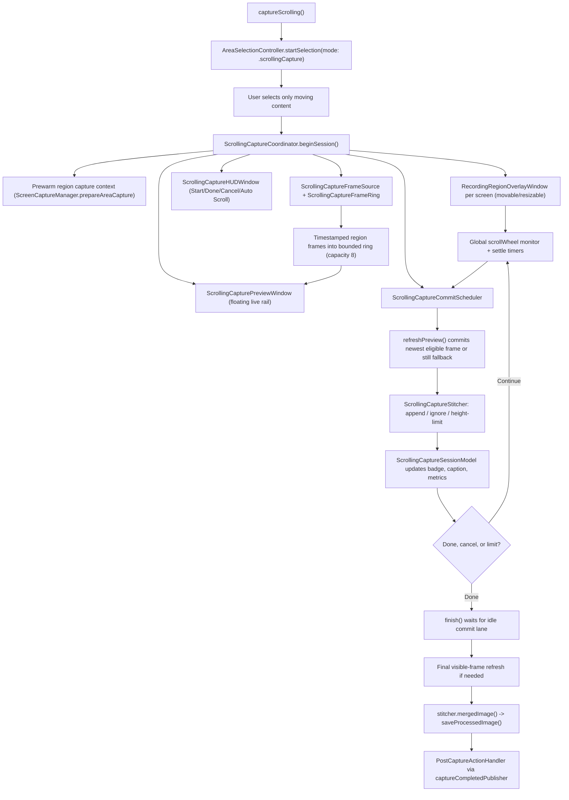

# Scrolling Capture

Scrolling capture stitches a scrollable region into one long screenshot while a live preview rail shows the committed result. This doc covers the self-contained subsystem in `Notinhas/Services/Capture/ScrollingCapture/` as of HEAD.

For trigger plumbing shared with other capture modes, see [`CAPTURE.md`](CAPTURE.md); for what happens after the stitched image is saved, see [`POST_CAPTURE.md`](POST_CAPTURE.md).

## Overview

- Entry point: `ScreenCaptureViewModel.captureScrolling()` (`Notinhas/Features/Capture/CaptureViewModel.swift`), fired from the menu bar, the global shortcut (default `⇧⌘6`), or `notinhas://capture/scrolling`.
- The entry resolves the save directory (`SandboxFileAccessManager.ensureExportDirectoryForOperation` → `TempCaptureManager.resolveSaveDirectory(for: .screenshot)`), hides own windows when excluded, then starts `AreaSelectionController.startSelection(mode: .scrollingCapture)`.
- The user drags a rect around **only the moving content** (fixed headers/footers confuse stitching).
- The rect, save directory, `ImageFormat`, and prefetched `SCShareableContent` task are handed to `ScrollingCaptureCoordinator.beginSession(rect:saveDirectory:format:prefetchedContentTask:onSessionEnded:)`.
- The subsystem is intentionally self-contained: session model, region overlay, HUD, preview rail, frame source, commit scheduling, stitcher, and metrics all live under `Services/Capture/ScrollingCapture/`. Treat the folder as one unit.

## Architecture



- `ScrollingCaptureSessionModel` (in `ScrollingCaptureTypes.swift`) is the single observable state object. Phases: `ready` → `capturing` → `finalizing` → `saving`. Runtime states: `ready`, `streaming`, `previewing`, `committing`, `paused`, `finalizing`, `saving`.
- The region overlay reuses `RecordingRegionOverlayWindow` (one per screen, same class as pre-recording setup) with guidance text bound from the session model. Move/resize/reselect is allowed only in `.ready`; starting capture locks interaction.
- `ScrollingCaptureHUDWindow` is a borderless non-activating `NSPanel` at `.popUpMenu` level anchored above the region; `ScrollingCaptureHUDView` renders Start (ready phase), then Cancel / Auto Scroll / Done (capturing phase).
- `ScrollingCapturePreviewWindow` is a non-interactive (`ignoresMouseEvents`) panel one level above the region overlay, positioned beside the region (right side preferred, left fallback). `ScrollingCapturePreviewView` + `ScrollingCapturePreviewRenderer` draw the rail (layer-backed, `.fit` scaling, 244pt panel, 220pt preview width, 160–420pt height).
- `Esc` cancels a `ready` session via local + global key monitors; during `capturing` it is ignored, and during `finalizing`/`saving` it is recorded as blocked input.

## Frame Pipeline

- The capture context is prewarmed at session start (and re-prewarmed after region edits) through `ScreenCaptureManager.prepareAreaCapture(rect:excludeDesktopIcons:excludeDesktopWidgets:excludeOwnApplication:prefetchedContentTask:)`, producing a reusable `PreparedAreaCaptureContext` with the session scale factor.
- **Live lane**: `ScrollingCaptureFrameSource` starts a region-scoped `SCStream` (30 fps max, cursor hidden, `.userInteractive` sample queue). Buffers are throttled to the publish interval, converted through a shared `CIContext`, sequenced, and delivered on the main actor. Incomplete frame statuses are dropped.
- **Shared timeline**: every published frame is appended to `ScrollingCaptureFrameRing` (capacity 8). Preview rendering and commit selection read the same ring, so the two lanes never diverge on different frame histories. `markCommitted(sequenceNumber:)` tracks progress.
- **Commit lane**: `ScrollingCaptureCommitScheduler` serializes stitch work and coalesces requests — only the latest pending request survives (`onRequestCoalesced` feeds metrics). `refreshPreview(reason:)` picks the newest ring frame after the last committed sequence number.
- **Still fallback**: when the ring has no usable new frame (stream not started, failed, or starved), the commit falls back to a still capture through the prewarmed context (`capturePreparedArea`). Commit frame source is logged as `stream` vs `still-fallback`.
- `ScrollingCaptureCommitFrameNormalizer` keeps every frame submitted to the stitcher at one pixel scale: it clamps the output scale to `max(sourceScaleFactor, minimumOutputScaleFactor)` and reuses `FrozenAreaCaptureSession.imageByPromotingScaleIfNeeded`, so region frames honor the same minimum 2x screenshot baseline as other modes — long screenshots from non-Retina displays do not save as 1x output.
- Stitching runs off the main actor on a serial `processingQueue` (`com.notinhas.scrolling-capture.processing`, `.userInitiated`); the full merged image render is skipped while the live preview is the visible surface.

## Scroll Detection

- A global `NSEvent` monitor watches `.scrollWheel` while `phase == .capturing`.
- Events count only when the pointer is inside the region expanded by 32pt hit slop, and only when vertical dominates (`|deltaY| >= |deltaX|`). Non-precise deltas are multiplied by 18; sub-0.5pt deltas are dropped.
- Deltas accumulate into `pendingScrollDistancePoints` with direction tracking. A direction reversal against the locked direction discards pending work and warns ("keep one direction"); mixed directions within a batch pause the commit and warn.
- The 50ms live-refresh loop schedules a commit when thresholds pass, with two gears — default (before the first accepted delta) and fast (after):

| Threshold | Default | Fast (locked) |
| --- | --- | --- |
| Min pending scroll to commit | 10 pt | 8 pt |
| Forced refresh distance | 42 pt | 28 pt (adaptive: ~42% of last accepted delta, clamped) |
| Scroll settle delay | 0.05 s | 0.03 s |
| Min spacing between commits | 0.09 s | 0.06 s |
| Scroll idle timeout (flush remaining) | 0.28 s | 0.28 s |

- Accumulated points convert into `expectedSignedDeltaPixels` (points × scale factor), blended and clamped against the last accepted delta (55%–185% band) so the stitcher searches a realistic delta window.

## Stitching

`ScrollingCaptureStitcher` is a nonisolated vertical stitcher confined to the coordinator's serial processing queue. It keeps the base raster, the last frame's raster, accepted `ContentSlice`s, detected static bands, the merge direction, and a cached merged image.

- **Hot path**: a fast row/block-difference guided match (`bestMatch` in `.guided` mode) scores candidate deltas with strided pixel sampling, using the expected delta window from scroll accumulation.
- **Static band detection**: top/bottom static bands (fixed headers/footers) and leading/trailing static side bands are inferred from the first accepted frame pair and locked once the merge direction resolves; matching skips those regions so pinned UI does not break alignment.
- **Vision as recovery, not default**: `VNTranslationalImageRegistration` estimates alignment for cross-validation (`fastGuidedMatchDisagreesWithVision` triggers a `.guidedVision` re-match) and for `.recoveryVision` search when the fast path finds nothing. Alignment path is reported per commit: `initial-frame`, `fast-guided`, `guided-vision`, `recovery-vision`, `no-movement`, `duplicate-boundary`, `alignment-failed`, `height-limit`.
- **Duplicate-boundary rejection**: near-zero frame difference with no strong Vision movement and no match (or a likely duplicate boundary) yields `ignoredNoMovement` with `likelyReachedBoundary = true`, which powers end-of-content guidance and auto-finish.
- **Safety**: `ScrollingCaptureStitchSafety` marks each update `confirmed`, `tentative(reason)`, or `unsafe(reason)`; final output is built from accepted slices only.
- **Outcomes**: `initialized`, `appended(deltaY)`, `ignoredNoMovement`, `ignoredAlignmentFailed`, `reachedHeightLimit`. Appends clamp to the remaining `maxOutputHeight` budget (`ScrollingCaptureConfiguration.maxOutputHeight = 32768` px).
- **Output**: `mergedImage()` concatenates accepted slices into the final `CGImage` (cached until the next append); `previewImage(maxPixelWidth:maxPixelHeight:)` renders the downscaled rail thumbnail (2x render scale) so the visible preview grows as slices are accepted.

## Auto Scroll

- Available after the first frame is locked (`ScrollingCaptureAutoScrollPolicy.canToggle` requires `phase == .capturing` and at least one accepted frame).
- Requires Accessibility permission: `requestAccessibilityPermissionForAutoScrollIfNeeded()` checks `AXIsProcessTrusted()`, prompts once via `AXIsProcessTrustedWithOptions`, and degrades to manual guidance when denied.
- Posts `CGEvent` scroll-wheel events (`deltaY = -15` pixels, 40ms cadence) at the pointer location through a combined-session event source, converted to Quartz global coordinates.
- The pointer must stay inside the region (16pt hover padding). When it leaves, auto scroll pauses at 150ms cadence with "place mouse inside selection" guidance and resumes when it returns.
- `ScrollingCaptureAutoScrollPolicy.stitchAction(for:)` maps stitch updates to behavior: `likelyReachedBoundary` or `reachedHeightLimit` → auto-finish; `ignoredAlignmentFailed` at 3 consecutive failures → stop auto scroll so the user can continue manually; otherwise keep scrolling.

## Preview Truth Badge

`ScrollingCapturePreviewTruthState` tells the user whether the rail shows committed truth:

| State | Badge | Meaning |
| --- | --- | --- |
| `ready` | — | No frame locked yet |
| `committedOnly` | Captured | Rail shows latest stitched result |
| `liveSynced` | Live | Live viewport matches committed output |
| `liveAhead` | Syncing | Live viewport is ahead of uncommitted scroll |
| `pausedRecovery` | Paused | Alignment/stream paused; slow down |
| `finalizing` | Finishing | Sealing the stitched result |
| `saving` | Saving | Writing the final image |

- Lag is computed from live-publish vs last-committed timestamps with a 90ms tolerance (`previewCommitLagMs`); `liveAhead` occurrences feed session metrics.
- The rail prioritizes the stitched preview image; the raw live viewport shows only while no committed preview exists and the truth state prefers it (`prefersLiveViewport`).

## Finish and Save

1. `finish()` stops auto scroll, enters `.finalizing`, and waits for the commit lane to go idle (`commitScheduler.waitForIdle()` plus in-flight refresh).
2. If significant scroll remains uncommitted (`|pendingScrollDistancePoints| > 2`), or no frame was ever captured, a final `refreshPreview` runs to seal the visible content.
3. The live stream stops, `stitcher.mergedImage()` becomes the final image, and the model enters `.saving`.
4. `ScreenCaptureManager.saveProcessedImage(_:to:format:scaleFactor:)` writes the file (minimum 2x output baseline for non-Retina displays) and emits `captureCompletedPublisher`.
5. `ScreenCaptureViewModel`'s single subscription routes the URL into `PostCaptureActionHandler.handleScreenshotCapture(url:)` — Quick Access, clipboard, auto-open, and history behave identically to a standard screenshot. See [`POST_CAPTURE.md`](POST_CAPTURE.md).
6. Empty results return the session to `.capturing`/`.paused` with recovery guidance instead of saving; save failures surface an error toast and keep the stitched result for another Done attempt.

## Metrics and Debug Logging

- `ScrollingCaptureSessionMetrics` (`ScrollingCaptureMetrics.swift`) accumulates per-session counters: scroll events, live-preview starts/failures/gaps, commit schedule/coalesce counts, stream vs still-fallback commits, refresh durations by reason, stitch outcomes, alignment paths, safety counts, finalizing duration, blocked inputs.
- The summary flushes once per session (reason `saved`/`cancelled`) as a `ScrollingCaptureDebug session-summary` debug line plus an info-level metrics line.
- Debug lines go through `DiagnosticLogger` into `~/Library/Logs/Notinhas/notinhas_YYYY-MM-DD.txt`. Filter them with:

```bash
grep 'ScrollingCaptureDebug' "$HOME/Library/Logs/Notinhas/notinhas_$(date +%F).txt"
```

- Useful events: `live-stream-started`, `live-stream-fallback`, `live-frame-sample`, `commit-frame-selected`, `stitch-update` (outcome, safety, confidence, delta error, durations), `refresh-failure`, `session-summary`.
- Session guidance, runtime badges, preview captions, and recovery toasts are localized through `L10n.ScrollingCapture*`; keep them in sync with [`LOCALIZATION.md`](LOCALIZATION.md).

## Key Files

| File | Responsibility |
| --- | --- |
| `Notinhas/Services/Capture/ScrollingCapture/ScrollingCaptureCoordinator.swift` | Session orchestration: windows, scroll monitoring, commit lane, auto scroll, finish/save |
| `Notinhas/Services/Capture/ScrollingCapture/ScrollingCaptureTypes.swift` | `ScrollingCaptureSessionModel`, phases, runtime states, truth states, guidance, auto-scroll policy |
| `Notinhas/Services/Capture/ScrollingCapture/ScrollingCaptureStitcher.swift` | Vertical stitcher: fast guided match, Vision recovery, static bands, safety, merged/preview output |
| `Notinhas/Services/Capture/ScrollingCapture/ScrollingCaptureFrameSource.swift` | Region-scoped `SCStream` publishing timestamped frames |
| `Notinhas/Services/Capture/ScrollingCapture/ScrollingCaptureFrameRing.swift` | Bounded frame history (capacity 8) shared by preview and commit lanes |
| `Notinhas/Services/Capture/ScrollingCapture/ScrollingCaptureCommitScheduler.swift` | Serial commit lane coalescing to the latest pending request |
| `Notinhas/Services/Capture/ScrollingCapture/ScrollingCaptureCommitFrameNormalizer.swift` | Uniform pixel scale for frames entering the stitcher |
| `Notinhas/Services/Capture/ScrollingCapture/ScrollingCaptureHUDWindow.swift` | Floating non-activating control panel (Start/Done/Cancel/Auto Scroll) |
| `Notinhas/Services/Capture/ScrollingCapture/ScrollingCaptureHUDView.swift` | SwiftUI HUD content and action buttons |
| `Notinhas/Services/Capture/ScrollingCapture/ScrollingCapturePreviewWindow.swift` | Non-interactive floating preview rail window |
| `Notinhas/Services/Capture/ScrollingCapture/ScrollingCapturePreviewView.swift` | SwiftUI rail content: truth badge, preview, caption, layout constants |
| `Notinhas/Services/Capture/ScrollingCapture/ScrollingCapturePreviewRenderer.swift` | Layer-backed `NSViewRepresentable` image surface (`.fit` scaling) |
| `Notinhas/Services/Capture/ScrollingCapture/ScrollingCaptureMetrics.swift` | Per-session metrics counters and summary context |

## Related docs

- [`CAPTURE.md`](CAPTURE.md) — capture triggers, area selection, other screenshot modes
- [`POST_CAPTURE.md`](POST_CAPTURE.md) — what happens after the stitched image is saved
- [`QUICK_ACCESS.md`](QUICK_ACCESS.md) — overlay card behavior for the saved capture
- [`SHORTCUTS.md`](SHORTCUTS.md) — global shortcut registration and defaults
- [`PREFERENCES.md`](PREFERENCES.md) — scrolling hints and related capture toggles
- [`LOCALIZATION.md`](LOCALIZATION.md) — ownership of session copy
- [`STRUCTURE.md`](STRUCTURE.md) — subsystem ownership in the runtime map
