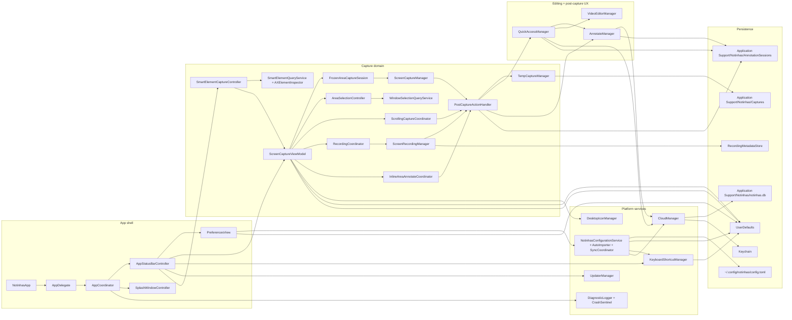

# Project Structure & Runtime Architecture

This doc mirrors the current Notinhas codebase and runtime ownership. Keep it in sync with source, not with intended architecture.

## Feature Docs

Separated feature docs cover each runtime area in depth:

- [`CAPTURE.md`](CAPTURE.md) — Screenshot, OCR, cutout, Smart Element, markup flows
- [`SCROLLING_CAPTURE.md`](SCROLLING_CAPTURE.md) — Long-screenshot sessions, stitching, auto scroll
- [`RECORDING.md`](RECORDING.md) — Screen/GIF recording pipeline, toolbar, metadata
- [`POST_CAPTURE.md`](POST_CAPTURE.md) — After-capture routing, destinations, clipboard, formats
- [`QUICK_ACCESS.md`](QUICK_ACCESS.md) — Floating card stack, actions, countdown, pins
- [`HISTORY.md`](HISTORY.md) — Capture history, retention, restore, storage cleanup
- [`ANNOTATE.md`](ANNOTATE.md) — Image annotation editor, sessions, presets, export
- [`VIDEO_EDITOR.md`](VIDEO_EDITOR.md) — Video trim/zoom/speed editing and export
- [`CLOUD.md`](CLOUD.md) — Cloud providers, credentials, manual uploads
- [`SHORTCUTS.md`](SHORTCUTS.md) — Global/overlay shortcut registration and conflicts
- [`PREFERENCES.md`](PREFERENCES.md) — Settings tabs, preference storage, defaults
- [`APP_LIFECYCLE.md`](APP_LIFECYCLE.md) — Launch sequence, onboarding, menu bar bootstrap
- [`UPDATES.md`](UPDATES.md) —  updater, channels, release flow

## Runtime Map



## Source Tree

```text
tools/
  localization/
    CatalogTool.swift

Notinhas/
  App/
    NotinhasApp.swift
    AppCoordinator.swift
    AppEnvironment.swift
    AppStatusBarController.swift

  Features/
    Annotate/
    Capture/
    CrashReport/
    Onboarding/
    Preferences/
    QuickAccess/
    Recording/
    Shortcuts/
    Splash/
    Updates/
    VideoEditor/

  Services/
    AppIdentity/
    Appearance/
    Capture/
      AreaSelectionBackdrop.swift
      AreaSelectionWindow.swift
      AXElementInspector.swift
      AXElementSnapshot.swift
      SmartElementQueryService.swift
      SmartElement/
        SmartElementCaptureController.swift
        SmartElementCapturePerformer.swift
        SmartElementCaptureProtocols.swift
        SmartElementOverlayView.swift
        SmartElementOverlayWindow.swift
        SmartElementWindowOwnerResolver.swift
      WindowSelectionQueryService.swift
      ScrollingCapture/
    Clipboard/
    Cloud/
    Configuration/
    Diagnostics/
    FileAccess/
    Media/
    Shortcuts/
    Updates/
    Wallpaper/

  Shared/
    Components/
    Extensions/
    Localization/
    Services/
    Styles/

  Common/
    Components/

  Config/
  Resources/
    Localization/
      Shared/
        *.xcstrings
      Features/
        *.xcstrings
      Generated/
      manifest.json
    *.lproj/

NotinhasTests/
  Services/
    Capture/
      *Tests.swift
  Features/
    Capture/
    Annotate/
    VideoEditor/
    QuickAccess/
  Shared/
    Extensions/
  Helpers/
  Fixtures/

NotinhasUITests/
  Features/
    Onboarding/
    Preferences/
    Annotate/
    QuickAccess/
```

## Feature Roots

| Path | Owns |
| --- | --- |
| `App/` | Entry point, app lifecycle, menu bar bootstrap, preferences wiring |
| `Features/Splash/` | Splash window, onboarding root coordinator, intro flow, multilingual welcome screen |
| `Features/Onboarding/` | Onboarding step views and visual system, including first-run language selection |
| `Features/Capture/` | High-level screenshot, OCR, cutout, scrolling-capture, and recording entry actions |
| `Features/Recording/` | Recording toolbar, overlays, live annotation, stop/GIF handoff |
| `Features/QuickAccess/` | Floating post-capture stack, temp-file persistence UX, drag-to-app, pinned screenshot windows |
| `Features/Annotate/` | Image editor, export, crop, blur, mockup, cutout-aware editing, inline area annotate |
| `Features/VideoEditor/` | Trim, zoom, speed (timelapse) segments, background, Smart Camera, GIF/video export |
| `Features/Preferences/` | General, Capture, Quick Access, Shortcuts, Permissions, History storage/retention, Cloud, Advanced, About tabs |
| `Features/Shortcuts/` | Keyboard shortcut cheat-sheet overlay |
| `Features/Updates/` |  menu binding and update UI bridge |
| `Features/CrashReport/` | Crash report prompt and diagnostics UX |

## Service Roots

| Path | Owns |
| --- | --- |
| `Services/Capture/` | ScreenCaptureKit capture engine, area selection overlay/controller, OCR scanning overlay, window-target resolution, Smart Element query helpers, recording engine, temp storage, post-capture routing |
| `Services/Capture/SmartElement/` | Standalone Smart Element overlay controller, per-screen live panels, window-owner resolution, capture performer, and protocol seams |
| `Services/Capture/ScrollingCapture/` | Long screenshot session model, live preview, stitcher, HUD, metrics |
| `Services/Cloud/` | S3/R2/Google Drive providers, upload orchestration, GRDB history, Keychain credentials, encrypted transfer, OAuth service |
| `Services/Configuration/` | TOML export/import facade, focused TOML parser/writer, schema validation, preference mutation helpers, debounced config.toml sync coordinator |
| `Services/FileAccess/` | Sandbox-scoped save-folder permissions and bookmarks |
| `Services/Media/` | OCR, QR payload detection, foreground cutout, GIF conversion helpers, WebP encode |
| `Services/Shortcuts/` | Global shortcuts, conflict detection, system shortcut checks |
| `Services/Diagnostics/` | Crash sentinel, logs, toasts, cleanup |
| `Services/Updates/` |  updater bootstrap |
| `Services/Wallpaper/` | Desktop icon and wallpaper helpers used by capture/editor UX |
| `Services/Appearance/` | Theme and appearance mode management |
| `Shared/Localization/` | Shared localization helpers for AppKit, service copy, alerts, toasts, and display labels |

## Persistence Map

```text
~/Library/Application Support/Notinhas/
  Captures/
    <temp screenshot or recording files when Save is OFF>
    RecordingProcessing/
      <per-session AVAssetWriter processing directories>
    RecordingMetadata/
      index.json
      Entries/
        <uuid>.json
  AnnotationSessions/
    <sha256-normalized-source-path>/
      manifest.json
      original.bin
      cutout.png                 # optional
      assets/
        <uuid>.bin               # optional embedded image assets
  notinhas.db
  DatabaseRecovery-<yyyyMMdd-HHmmss>[-N]/   # database files archived by launch recovery
    notinhas.db
    notinhas.db-wal
    notinhas.db-shm

~/.config/notinhas/
  config.toml                  # user-managed export/import + startup auto-apply + background sync path
```

| Store | Used for |
| --- | --- |
| `UserDefaults` | Preferences, shortcut configs, onboarding flags, feature toggles |
| `Keychain` | Cloud access key, secret key, optional cloud protection password |
| `Application Support/Notinhas/Captures/` | Temp captures, per-session recording processing files, and recording metadata sidecars |
| `Application Support/Notinhas/AnnotationSessions/` | Sidecar packages for committed editable screenshot annotation sessions |
| `Application Support/Notinhas/notinhas.db` | Capture history and cloud upload history via GRDB |
| `~/.config/notinhas/config.toml` | User-managed TOML preferences file, created from the onboarding config access step or Settings -> Advanced after user-confirmed folder access, replaced by explicit Import/Restore defaults actions, auto-applied on launch when changed, and synced from current settings before Open config.toml when safe |

## Implementation Notes That Matter

- `ScreenCaptureViewModel` is the main entrypoint for capture actions fired from shortcuts, the status bar menu, or `notinhas://` automation URLs. Deep links can be toggled on/off globally in Advanced preferences (`urlSchemeEnabled`).
- `AppStatusBarController` is the AppKit bridge for the menu bar item. It now keeps the menu accessible during active recording, renders the live recording timer from `ScreenRecordingManager`, and coordinates temporary Preferences-window exclusion for record-own-app sessions.
- Area screenshot now freezes the active display first through `FrozenAreaCaptureSession`, then keeps one overlay session that can toggle between manual region selection and application window selection with the configurable `Application Capture` overlay key. The default key is `A`.
- Area + inline annotate uses `InlineAreaAnnotateCoordinator` with `InlineAreaAnnotateSession` and `InlineAreaAnnotateWindow`. It starts after a frozen all-display snapshot set, creates coordinated per-display panels that share one desktop coordinate space, reuses Annotate state/canvas/export services, and routes the saved image through `PostCaptureActionHandler`.
- `AreaSelectionController` and `AreaSelectionWindow` own the cross-display overlay session, target-display keyboard ownership for screenshot sessions, and highlight rendering for both manual and application screenshot interaction modes.
- `WindowSelectionQueryService` resolves the hovered topmost app window from CoreGraphics window lists plus `SCShareableContent`, so app-mode hover stays accurate without doing expensive live queries on every draw pass. It also propagates the owner PID into `WindowCaptureTarget.ownerPID` for exact window capture metadata.
- `Services/Capture/SmartElement/` owns the standalone Smart Element session. `SmartElementCaptureController` creates live per-screen overlay panels, resolves the topmost non-Notinhas owner with `SmartElementWindowOwnerResolver`, forwards that PID into `SmartElementQueryService`, and commits highlighted rects through `SmartElementCapturePerformer`.
- `SmartElementQueryService` and `AXElementInspector` power Smart Element hover detection. The service throttles cursor updates and dispatches AX queries to a background queue to ensure 60fps performance without blocking the main thread, gates on `AXIsProcessTrusted()`, queries the target app via `AXUIElementCreateApplication(pid)`, walks up to the nearest meaningful AX role, and flips the AX top-left rect into AppKit bottom-left global coordinates before publishing. The protocol seam (`AXSnapshotProviding` + `AXElementSnapshot`) keeps the pipeline unit-testable.
- `PostCaptureActionHandler` executes clipboard copy before slower Quick Access and screenshot auto-open actions after files already exist, so auto-copy is not blocked by thumbnail generation or overlay work.
- `PostCaptureActionHandler` also persists editable annotation sidecars when screenshot default presets are auto-applied before the file reaches clipboard, Quick Access, history, or Annotate auto-open. `ScreenshotPresetAutoApplier` keeps this route lightweight by rendering preset canvas effects directly, without spinning up a full Annotate state object.
- Manual Open Annotate (`⇧⌘A`, menu bar, and `notinhas://open/annotate`) opens an empty editor through `AnnotateManager.openEmptyAnnotation()` and then applies the configured clipboard-image behavior: ask by default, load automatically, or do nothing.
- Settings → Annotate owns full-editor Annotate preferences, including clipboard-image import behavior, `Close after drop`, and `Reactivate after drop`. `Close after drop` defaults on for legacy behavior; `AnnotateWindowController` reads both drag preferences when a drag-to-app session completes.
- `AnnotateManager` restores screenshot editability from the Quick Access session cache first, then `AnnotationSessionStore`, then the flattened screenshot file. `AnnotationSessionStore` stores only committed sessions and validates the source file signature before returning editable data.
- `TempCaptureManager` is where the `Save` after-capture toggle becomes real behavior. Recording uses an internal per-session processing directory first, then moves the final video to export or the temp capture root after AVAssetWriter finishes.
- `DatabaseManager` is initialized before launch cleanup and schedulers run. If `notinhas.db` cannot open or migrate, `AppDelegate` presents repair/reset/quit recovery UI; reset archives existing DB files into `DatabaseRecovery-<yyyyMMdd-HHmmss>[-N]/` before creating a fresh database.
- `QuickAccessActionConfigurationStore` owns user-configurable Quick Access action visibility, context-menu order, and card slot assignments. Settings → Quick Access lets users reorder the context menu from the list, then drag actions onto explicit preview slots for the live hover card layout.
- `QuickAccessDraggableView` owns Quick Access card gestures: mouse swipe-to-dismiss, drag-to-app, and optional two-finger horizontal swipe-to-dismiss on the preview card.
- `RecordingCoordinator` owns the toolbar/overlay UX. `ScreenRecordingManager` owns the media pipeline.
- `ScrollingCaptureCoordinator` is its own subsystem. Treat `Services/Capture/ScrollingCapture/*` as a unit.
- `ScrollingCaptureFrameSource` publishes timestamped region frames into `ScrollingCaptureFrameRing`, so live preview and commit/stitch decisions share one bounded frame timeline before falling back to still area capture.
- `CloudManager` is a facade. Provider-specific behavior lives under `Services/Cloud/`.
- `NotinhasConfigurationService` is the Settings-facing facade for TOML export/import. `NotinhasConfigurationAccessGranting` shares the config folder grant flow between upgrade onboarding and Settings -> Advanced, creating `~/.config/notinhas` and `config.toml` after a successful grant if either is missing. Settings import validates the selected `.toml`, replaces the managed `config.toml`, then applies it so app state and file state stay aligned. Open config.toml syncs current settings into the managed file first when the file still matches Notinhas's last applied/exported signature; if the file has unapplied external edits, Settings asks before replacing it. `NotinhasConfigurationAutoImporter` runs during startup, hashes `config.toml`, and imports only when the file changed since the last successful launch-time apply. Import paths validate the whole file before applying any mutation and intentionally exclude Keychain secrets, history rows, temp captures, and sandbox bookmarks.
- `Shared/Localization/L10n.swift` is the bridge for user-facing copy that does not live directly in SwiftUI view literals.
- `Resources/Localization/Shared/*.xcstrings` and `Resources/Localization/Features/*.xcstrings` are the runtime localization catalogs.
- `tools/localization/CatalogTool.swift` owns audit and verify for split localization catalogs.
- `Resources/*/InfoPlist.strings` still own privacy permission text.
- Keep brand names, file formats, key labels, MIME types, and other technical tokens verbatim unless product behavior explicitly changes.

## Test Architecture

Notinhas uses peer test roots at the repository root so test code stays out of
the app source folder and Xcode can bind each root to the correct target.

- **NotinhasTests** — Unit Testing Bundle. Mirrors the `Notinhas/` source tree by
  domain, for example `NotinhasTests/Services/Capture/*Tests.swift` tests
  `Notinhas/Services/Capture/*`.
- **NotinhasUITests** — planned UI Testing Bundle for end-to-end user flows.

Current Xcode project contract:

- `Notinhas.xcodeproj` has a file-system synchronized root group for
  `NotinhasTests/`.
- The shared `Notinhas` scheme uses `Notinhas.xctestplan`, which includes
  `NotinhasTests` in its Test action.
- Test helpers live in `NotinhasTests/Helpers/`.
- Fixtures, when needed, should live in `NotinhasTests/Fixtures/`.

Do not place XCTest files under `Notinhas/`; that folder is synchronized into the
app target.

Directory structure mirrors the app: `NotinhasTests/Services/Cloud/AWSV4SignerTests.swift` tests `Notinhas/Services/Cloud/AWSV4Signer.swift`. Shared mocks and fixture assets live in `NotinhasTests/Helpers/` and `NotinhasTests/Fixtures/`.

### Test Priority

| Layer | Type | Priority | Notes |
| --- | --- | --- | --- |
| `Services/Cloud/AWSV4Signer` | Unit | **P0** | Pure crypto, zero deps |
| `Services/Cloud/LifecycleXMLParser` | Unit | **P0** | Pure XML parsing |
| `Services/Capture/CaptureOutputNaming` | Unit | **P0** | Template + sanitization |
| `Shared/Extensions/` | Unit | **P0** | Pure utilities |
| `Services/Media/` | Unit | **P1** | Vision/CoreImage, needs fixture images |
| `Services/Capture/TempCaptureManager` | Unit | **P1** | File lifecycle, mock `FileManager` |
| `Services/Capture/PostCaptureActionHandler` | Unit | **P1** | Routing logic, protocol DI |
| `Services/Cloud/CloudManager` | Integration | **P2** | Facade, mock providers |
| `Features/Capture/CaptureViewModel` | Unit | **P2** | State transitions only, high coupling |
| `Features/Onboarding/`, `Features/Preferences/` | UI | **P3** | XCUITest |

### Key Constraints

- Test target needs its own entitlements (copy `Notinhas.entitlements`, drop  keys).
- Use `UserDefaults(suiteName: "NotinhasTests")` to isolate test state.
- `@MainActor` singletons (`TempCaptureManager.shared`) require `@MainActor` test methods.
- `SCShareableContent`/`SCStream` cannot be mocked — test capture logic through `CaptureOutputNaming` and `PostCaptureActionHandler` instead.
- OCR fixtures: bundle test images in `NotinhasTests/Fixtures/`, load via `Bundle(for: type(of: self))`.
- CI: GitHub Actions macOS 14+ runners have Screen Recording permission. Older runners: `try XCTSkipUnless(CGPreflightScreenCaptureAccess())`.

## Agent Edit Guide

| Task | Start here |
| --- | --- |
| Localization, String Catalog, alert copy, translated display labels | `Resources/Localization/manifest.json`, `tools/localization/CatalogTool.swift`, `Shared/Localization/L10n.swift`, `docs/LOCALIZATION.md` |
| New screenshot mode or capture behavior | `Features/Capture/CaptureViewModel.swift`, `Services/Capture/AreaSelectionWindow.swift`, `Services/Capture/SmartElement/`, `Services/Capture/ScreenCaptureManager.swift`, `Services/Capture/WindowSelectionQueryService.swift`, `docs/CAPTURE.md` |
| Scrolling capture UX or stitching | `Services/Capture/ScrollingCapture/`, `docs/SCROLLING_CAPTURE.md` |
| Recording toolbar, overlays, GIF flow | `Features/Recording/`, `Services/Capture/ScreenRecordingManager.swift`, `docs/RECORDING.md` |
| Post-capture actions or temp-file logic | `Features/Preferences/PreferencesManager.swift`, `Services/Capture/PostCaptureActionHandler.swift`, `Services/Capture/TempCaptureManager.swift`, `Features/QuickAccess/`, `docs/POST_CAPTURE.md`, `docs/QUICK_ACCESS.md` |
| Annotate editor (full + inline) | `Features/Annotate/`, `docs/ANNOTATE.md` |
| Editable screenshot annotation history | `Features/Annotate/Services/AnnotationSessionStore.swift`, `Features/Annotate/Models/PersistedAnnotationSession.swift`, `Features/History/`, `Services/History/CaptureHistoryRetentionService.swift`, `docs/ANNOTATE.md`, `docs/HISTORY.md` |
| Video editor or Smart Camera | `Features/VideoEditor/`, `Services/Capture/RecordingMetadata.swift`, `docs/VIDEO_EDITOR.md` |
| Cloud upload/config transfer | `Services/Cloud/`, `Features/Preferences/Components/PreferencesCloudSettingsView.swift`, `Features/QuickAccess/Components/QuickAccessCardView.swift`, `Features/Annotate/Components/AnnotateBottomBarView.swift`, `docs/CLOUD.md` |
| TOML config export/import + startup auto-apply | `Services/Configuration/`, `Features/Onboarding/Components/OnboardingConfigAccessView.swift`, `Features/Preferences/Components/PreferencesAdvancedSettingsView.swift`, `App/AppCoordinator.swift`, `docs/CONFIGURATION.md` |
| Onboarding or app startup | `App/`, `Features/Splash/`, `Features/Onboarding/`, `docs/APP_LIFECYCLE.md` |
| Shortcuts and conflicts | `Services/Shortcuts/`, `Features/Shortcuts/`, `docs/SHORTCUTS.md` |
| Unit tests for services | `NotinhasTests/Services/`, `NotinhasTests/Helpers/` |
| UI tests for user flows | `NotinhasUITests/Features/` |
| Test fixtures and mocks | `NotinhasTests/Helpers/`, `NotinhasTests/Fixtures/` |

## Current Behavior Clarifications

- Cloud upload is manual-only. The `AfterCaptureAction.uploadToCloud` after-capture option was removed (commit `dd4ccd5`), so nothing auto-uploads inside `PostCaptureActionHandler`. Manual upload entry points live in Quick Access cards, Annotate, Video Editor, and History; they show when `CloudManager.isConfigured` is true, and Quick Access / editor surfaces additionally require the `uploadToCloud` action to be enabled in `QuickAccessActionConfigurationStore` (Preferences → Quick Access → Quick Actions).
- Quick Access can outlive the original capture location: saved captures stay in the export folder, temp captures are deleted when dismissed unless the user explicitly saves them.
- Two-finger swipe-to-dismiss is scoped to the Quick Access preview card and follows the same side-aware dismiss direction as mouse swipe: rightward on right-side panels, leftward on left-side panels.
- Committed screenshot annotations are stored as sidecar packages in Application Support. History/Quick Access restore uses those packages to reopen editable annotations after the rendered screenshot has been saved, while delete, clear-history, retention sweep, and temp-to-export save paths remove or move sidecars with the source file.
- Sidecar persistence is intentionally commit-based. There is no continuous annotation autosave or draft recovery package for an unsaved Annotate window during app quit.
- Quick Access screenshot pin opens an independent always-on-top pin window with fit-based sizing, a minimum interactive footprint, compact zoom/drag controls, pinch and Command-scroll zoom, close or Esc-to-unpin, drag-to-app from the current pinned image, and a lock mode that fades the screenshot while allowing pointer interaction with windows underneath except for the unlock control.
- Annotate, Video Editor, GIF conversion, and cloud upload pause Quick Access countdowns for the active item and resume them when the activity ends.
- During recording, the menu bar item no longer turns into a left-click stop button. It keeps the normal menu path available, adds a live timer to the status item, and exposes stop plus pause/resume from the active menu section.
- The recording shortcut (`GlobalShortcutKind.recording`, default `⇧⌘5`) is a start/stop toggle handled in `CaptureViewModel.toggleRecordingFromShortcut(...)`. An optional `GlobalShortcutKind.pauseResumeRecording` ships unbound (seeded into `clearedShortcuts` on first launch) and, when bound via Preferences → Shortcuts → Recording, dispatches to `ScreenRecordingManager.togglePause()` only while a recording is active.
- When Preferences is opened during an active recording with own-app capture enabled, Notinhas temporarily excludes that Settings window from the stream instead of forcing the user to stop recording first.
- TOML config import is all-or-nothing for validation errors. Warnings, such as
  imported folder paths that may need macOS file-access confirmation, are shown
  after import and do not block applied changes.
- `~/.config/notinhas/config.toml` is not live-watched for direct edits. Valid
  direct edits are applied when Notinhas launches again, after macOS folder access
  has been granted once through onboarding or Settings -> Advanced. Opening the
  file from Settings first syncs app-originated settings changes when doing so
  will not silently overwrite unapplied external edits.
- Existing users who have already completed onboarding see the onboarding flow
  open directly on the config access step once when launch-time auto-import
  detects missing folder access. Skipping it leaves a warning/action in
  Settings -> Advanced.
