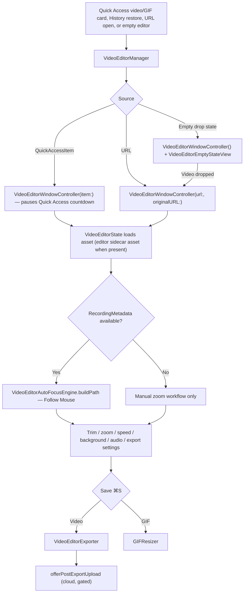

# Video Editor

This doc covers the video editor in `Notinhas/Features/VideoEditor/`: windowing, trim, zoom segments, Follow Mouse (Smart Camera), speed (timelapse) segments, background/padding, audio mixing, export, GIF resizing, and undo/redo. How recordings and their mouse/audio metadata are produced lives in [`RECORDING.md`](RECORDING.md).

## Entry and Windowing

- `VideoEditorManager` (singleton) tracks windows per Quick Access item id, per URL, and one empty editor; opening an existing item/URL reuses its window.
- Activation policy: switches the app to `.regular` (Dock + ⌘Tab) while an editor is open, reverts to accessory when the last editor/Annotate window closes.
- `VideoEditorWindowController` (`Managers/VideoEditorWindowController.swift`) creates a 1200×800 `VideoEditorWindow` centered on the main screen. Opening from a Quick Access item pauses that item's countdown (`QuickAccessManager.pauseCountdownForEditingItem`) and resumes on close.
- `windowShouldClose` routes through an unsaved-changes alert (Save / Don't Save / Cancel) driven by `state.hasUnsavedChanges`, mirrored to `window.isDocumentEdited`.

## State and Playback

- `VideoEditorState` (`VideoEditorState.swift`) is the central model: asset, trim range, zoom/speed segments, background, export settings, undo stacks. `VideoEditorPlaybackState` holds playhead/playing/scrubbing.
- Playback position comes from an `AVPlayer` periodic time observer at 1/30 s; an item-end observer loops playback within the trim range.
- When a Notinhas recording has an editor audio source sidecar, the state's asset URL is swapped to the multitrack sidecar (`editorAssetURL(for:metadata:)`) while save/replace keeps targeting the user-facing compatible file.

## Trim

- Visual timeline `Components/VideoEditorVideoTimelineView.swift` with frame-strip thumbnails (`VideoEditorVideoTimelineFrameStrip`) and trim handles (`VideoEditorVideoTrimHandlesView`).
- Frame extraction uses an adaptive `FrameExtractionProfile` — 12 / 16 / 25 frames depending on track/duration, default 25 with zero tolerance.
- Minimum trim duration 1 s; handle drags clamp the playhead and record undoable `EditorAction.trimStart/trimEnd`.

## Zoom Segments

- `ZoomSegment` (`Models/VideoEditorZoomSegment.swift`): `duration` 0.5–30 s (default 2), `zoomLevel` 1–4x (default 2), `zoomCenter` normalized 0...1, `ZoomType.auto/.manual`, `followSpeed`, `focusMargin`. `ZoomSegment.centered(at:)` places a new segment centered on the playhead; the **Z** key adds one (`VideoEditorMainView` keyboard shortcut).
- Transitions: ease-in-out cubic (`ZoomCalculator.easeInOutCubic`), `transitionDuration` default 0.4 s clamped to 0.15–0.75 and to 45 % of the segment per edge; the editor-wide `state.zoomTransitionDuration` is user-adjustable in the right sidebar.
- `Services/VideoEditorZoomCalculator.swift` computes per-frame zoom progress/crop rects; shared by preview and the export compositor.
- UI: zoom timeline track (`VideoEditorZoomTimelineTrack` + `VideoEditorZoomBlockView`), center picker (`VideoEditorZoomCenterPicker`, with presets top-left/top-right/bottom-left/bottom-right/center), live preview overlay (`VideoEditorZoomPreviewOverlay`), settings popover (`VideoEditorZoomSettingsPopover`).

## Follow Mouse (Smart Camera)

- `Services/VideoEditorAutoFocusEngine.swift` `buildPath` consumes `RecordingMetadata` (see [`RECORDING.md`](RECORDING.md)) and reconstructs a smooth camera path: dead-zone around the current center with adaptive shrink under motion, exponential smoothing, cursor-speed clamp, last-visible-position fallback when the cursor leaves the capture, resample to ≤60 Hz, all clamped to the frame.
- `AutoFocusSettings` (`Models/VideoEditorAutoFocusSettings.swift`): `followSpeed` range 0.2–1.0 (default 0.55), `focusMargin` range 0.2–0.9 (default 0.45), `defaultZoomLevel` 2.0.
- New zoom segments default to `.auto` when mouse metadata exists; otherwise manual.

## Speed (Timelapse) Segments

- `SpeedSegment` (`Models/VideoEditorSpeedSegment.swift`): `rate` 0.25–8x (presets 0.25/0.5/1/2/4/8), min duration 0.5 s; segments cannot overlap (state-level validation).
- `Services/VideoEditorSpeedTimeMap.swift` is the single original↔scaled time-mapping authority reused by export, preview, playhead, and thumbnails.
- Export applies `scaleTimeRange` to composition video + audio tracks in reverse segment order, remaps zoom times and auto-focus keyframes into the scaled timeline, and preserves audio pitch via `audioTimePitchAlgorithm = .spectral`.
- Live preview is approximate: it drives `AVPlayer.rate` per active segment instead of rebuilding a scaled composition.
- Video only — the GIF save path does not bake timeline edits, so the speed track is hidden for GIF sources.

## Background and Padding

- `BackgroundStyle` (shared `Notinhas/Features/Annotate/Models/AnnotateBackgroundStyle.swift`): `none`, `gradient`, `wallpaper(URL)`, `blurred(URL)`, `solidColor`. Combined with padding, shadow, corner radius, alignment, and aspect controls in the left sidebar (`VideoEditorVideoBackgroundSidebarView`); background changes are undoable.

## Audio in the Editor

- Multitrack recordings load the sidecar asset (see State above). Track roles come from stored metadata keyed by `AVAssetTrack.trackID`, falling back to `ScreenRecordingManager` writer order for older metadata.
- `VideoEditorAudioTrackRole` (`Models/VideoEditorExportSettings.swift`): `mixed`, `systemAudio`, `microphone`, `additional(Int)`. Per-role volume sliders in the export settings panel; `VideoEditorAudioMixFactory.makeAudioMix` builds the role-aware `AVAudioMix` shared by preview and export, so volume changes are audible before saving.
- Recordings made before the sidecar existed contain one mixed track and expose a single volume control; separated sources cannot be recovered from them.
- Exports are re-normalized to one stereo AAC track after multitrack export (`RecordingAudioCompatibilityExporter`), so saved files stay broadly compatible.

## Export

`Services/VideoEditorExporter.swift` routes `exportTrimmed(state:to:progress:)`:

| Condition | Path |
| --- | --- |
| Zooms, background, or speed segments present | `exportWithZooms` — `AVMutableComposition` + custom `ZoomCompositor` (`AVVideoCompositing`, CI/Metal per-frame render) |
| `exportSettings.audioMode == .mute` (no effects) | `exportVideoOnly` |
| Otherwise | `exportStandard` |

- Custom dimensions: `ExportDimensionPreset` + `VideoEditorExportLayout` (`Models/VideoEditorExportSettings.swift`), even-aligned pixel sizes; quality presets live in the same export settings model.
- Save flow (`VideoEditorWindowController.showSaveConfirmation`): temp captures save directly to a chosen destination; saved files prompt Replace Original vs Save As Copy.
  - Replace original: export to temp, move original to `.<name>.backup`, atomic `replaceItemAt` swap, restore from backup on failure; recording metadata for the replaced file is deleted. Permission-denied falls back to a Save As Copy prompt.
  - Save as copy: `_trimmed` suffix suggestion (`generateCopyFilename`, counter on collision) + `NSSavePanel`.
- After a successful export, `offerPostExportUpload` offers a cloud upload — gated by `CloudManager.shared.isConfigured` **and** `QuickAccessActionConfigurationStore.shared.isEnabled(.uploadToCloud)`. Accepting uploads via `CloudManager.upload`, copies the public URL to the pasteboard, and syncs the cloud URL back to the linked Quick Access item.

## GIF Editing

- GIF mode is dimension-change only — no trim, zoom, or speed; saving with unchanged dimensions shows a "no changes" alert.
- `Services/GIFResizer.swift`: ImageIO per-frame resize that preserves loop count and frame delays; `GIFMetadata` reads source properties; `VideoEditorAnimatedGIFView` renders the animated preview.
- Replace-original and save-as-copy (`_resized.gif`) flows mirror video.

## Undo / Redo

- In-memory `undoStack`/`redoStack` of `EditorAction` (max 50) inside `VideoEditorState`; covers trim, zoom add/remove/update, speed add/remove/update/toggle, mute, and background changes. Shortcuts: ⌘Z / ⇧⌘Z (toolbar buttons in `VideoEditorToolbarView`).
- Any recorded action sets `hasUnsavedChanges` → `isDocumentEdited` + close alert.

## Bottom Bar (HEAD)

`Components/VideoEditorBottomBar.swift`: **Cancel** | optional cloud-upload button (only when `CloudManager.shared.isConfigured && QuickAccessActionConfigurationStore.shared.isEnabled(.uploadToCloud)`; label flips to re-upload when a cloud key exists; disabled while the card was already uploaded) | **Convert/Save** (⌘S; title is "Save" for temp captures, "Convert" otherwise) with an export progress strip (`VideoEditorExportProgressOverlay` during export). ⌘U uploads directly (`VideoEditorMainView`).

## Key Files

| File | Responsibility |
| --- | --- |
| `Notinhas/Features/VideoEditor/VideoEditorManager.swift` | Window lifecycle, activation policy, Quick Access countdown pause |
| `Notinhas/Features/VideoEditor/Managers/VideoEditorWindowController.swift` | Save/replace/copy/GIF flows, unsaved-changes alert, post-export upload offer |
| `Notinhas/Features/VideoEditor/VideoEditorState.swift` | Central editor model, playback, trim/zoom/speed mutations, undo/redo |
| `Notinhas/Features/VideoEditor/Models/VideoEditorZoomSegment.swift` | Zoom segment model and clamps |
| `Notinhas/Features/VideoEditor/Models/VideoEditorSpeedSegment.swift` | Speed segment model and rate presets |
| `Notinhas/Features/VideoEditor/Models/VideoEditorAutoFocusSettings.swift` | Follow Mouse tunables (followSpeed, focusMargin) |
| `Notinhas/Features/VideoEditor/Models/VideoEditorExportSettings.swift` | Dimension presets, audio roles/mix factory, quality presets |
| `Notinhas/Features/VideoEditor/Services/VideoEditorAutoFocusEngine.swift` | Smart Camera path reconstruction from `RecordingMetadata` |
| `Notinhas/Features/VideoEditor/Services/VideoEditorZoomCalculator.swift` | Per-frame zoom progress/crop math, easing, transition clamps |
| `Notinhas/Features/VideoEditor/Services/VideoEditorSpeedTimeMap.swift` | Original↔scaled time mapping for speed segments |
| `Notinhas/Features/VideoEditor/Services/VideoEditorExporter.swift` | Export routing, composition build, replace/copy, audio normalization |
| `Notinhas/Features/VideoEditor/Services/VideoEditorZoomCompositor.swift` | Custom `AVVideoCompositing` per-frame zoom/background renderer |
| `Notinhas/Features/VideoEditor/Services/GIFResizer.swift` | ImageIO GIF resize preserving loop/delays |
| `Notinhas/Features/VideoEditor/Components/VideoEditorBottomBar.swift` | Cancel / cloud-upload / Convert-Save bar |
| `Notinhas/Services/Capture/RecordingMetadata.swift` | Metadata consumed by Follow Mouse and multitrack audio |

## Related docs

- [`RECORDING.md`](RECORDING.md) — recording pipeline, GIF conversion, Smart Camera metadata format and store
- [`CAPTURE.md`](CAPTURE.md) — post-capture routing, Quick Access actions, history restore
- [`STRUCTURE.md`](STRUCTURE.md) — runtime map and persistence layout
